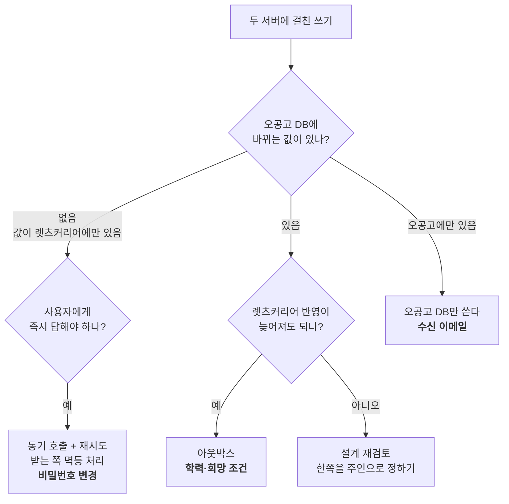
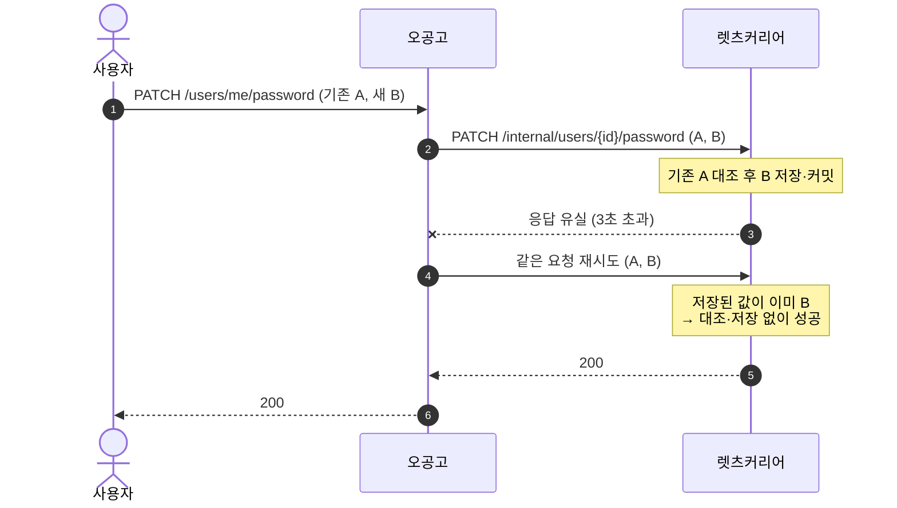
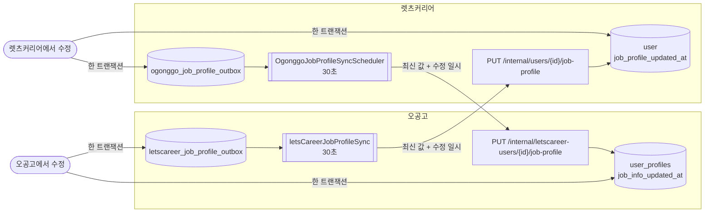
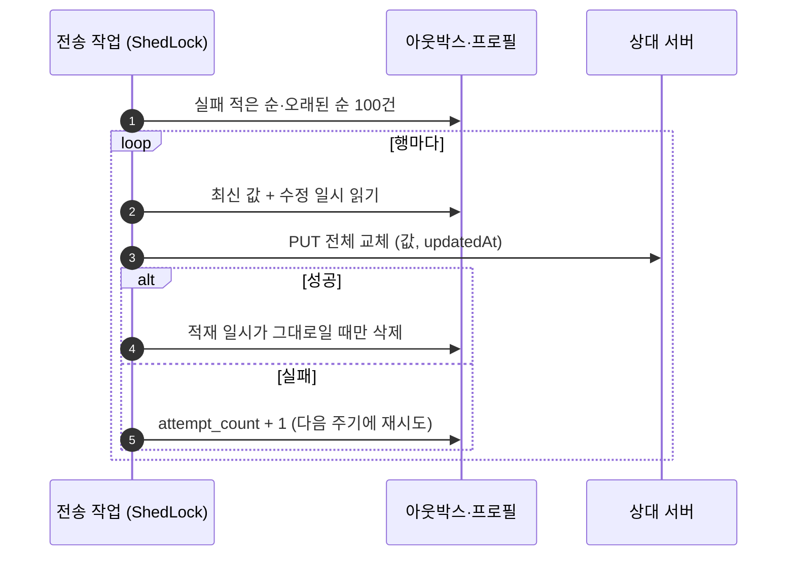
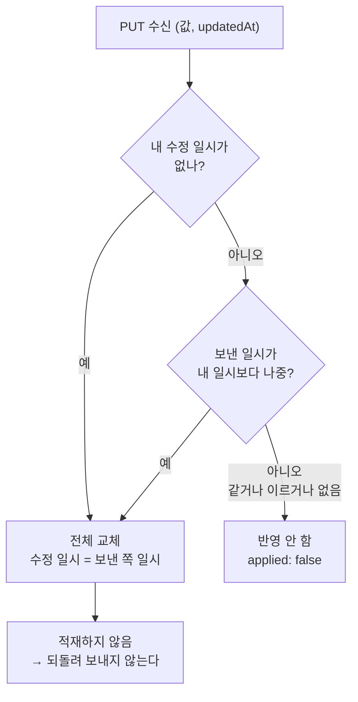
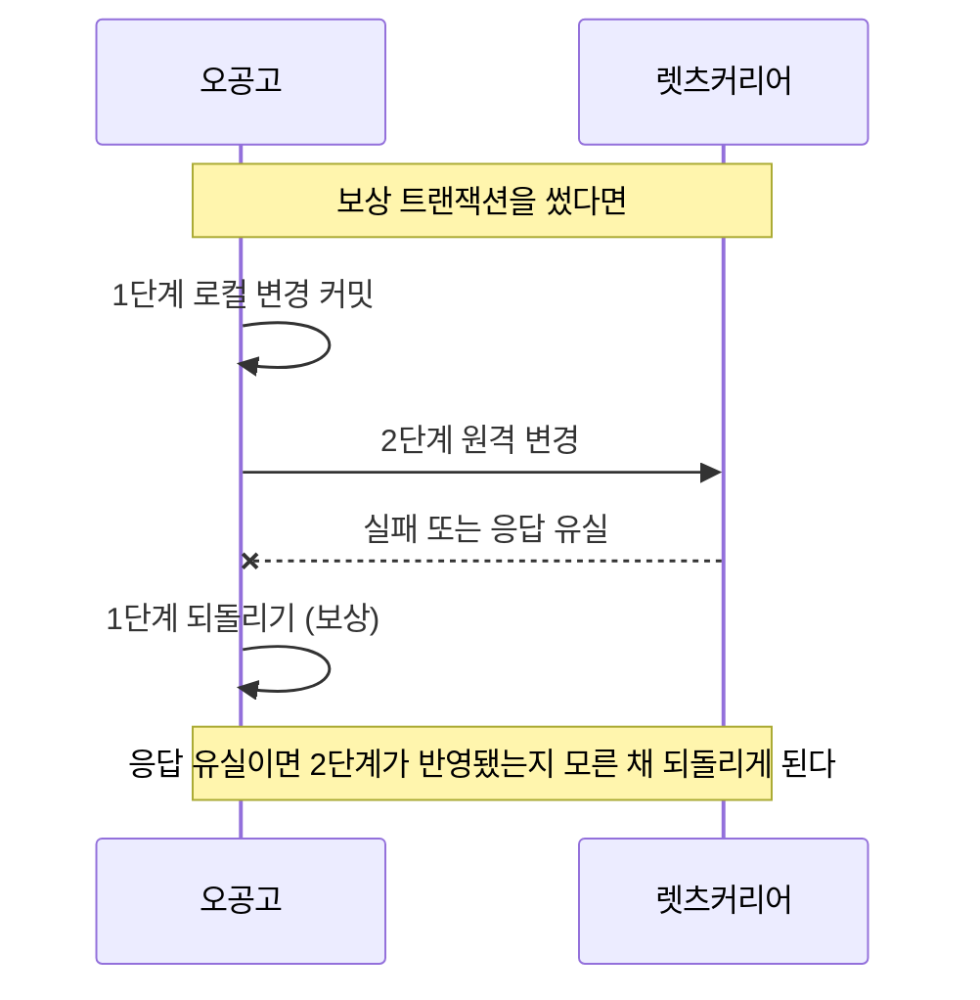

# 렛츠커리어 연동 쓰기의 일관성

- 상태: Accepted
- 결정일: 2026-09-29
- 적용 범위: `ogonggo-api-user`, `ogonggo-core`, `lets-career-server`
- 예상 독자: 오공고와 렛츠커리어 사이에 값을 쓰는 기능을 추가하거나 리뷰하는 팀원
- 리뷰 상태: 팀 리뷰 필요

API 계약(경로, 요청·응답, 오류 코드)은 [사용자 인증 문서](authentication.md)에 있습니다. 이 문서는 두 서버에 걸친 쓰기가 **실패했을 때 어떻게 맞추는지**와 그렇게 정한 이유를 다룹니다.

## 1. 먼저 알아야 할 결정

> 두 서버를 한 트랜잭션으로 묶지 않는다. 기능마다 "누가 값을 갖는가"와 "사용자에게 즉시 답해야 하는가"로 방식을 고르고, 모든 방식은 같은 요청을 여러 번 보내도 결과가 같게(멱등) 만든다.

| 기능 | 값의 주인 | 방식 | 렛츠커리어가 죽어 있으면 |
| --- | --- | --- | --- |
| 오늘의 공고 수신 이메일 | 오공고 | 오공고 DB만 쓴다 | 영향 없음 |
| 비밀번호 변경(일반 회원) | 렛츠커리어 | 동기 호출 + 응답 없을 때 재시도 | 503. 변경 실패 |
| 학력·희망 조건 | 양쪽 | 양방향 아웃박스 + 나중에 고친 쪽이 이긴다 | 오공고 수정은 성공, 렛츠커리어 반영은 복구 후 |

**보상 트랜잭션(사가)은 쓰지 않습니다.** 이유는 [5절](#5-보상-트랜잭션을-쓰지-않은-이유)에 있습니다.

## 2. 무엇으로 방식을 골랐나

- 아웃박스는 **오공고 DB 변경과 "보낼 일"을 한 트랜잭션에 묶는** 장치입니다. 오공고 DB에 바뀌는 값이 없으면 묶을 대상이 없습니다.
- 아웃박스는 **결국 반영됨**만 보장합니다. 사용자가 결과를 바로 알아야 하는 쓰기(기존 비밀번호 불일치 같은)는 비동기로 보낼 수 없습니다.

## 3. 비밀번호 변경: 동기 호출과 재시도

일반 회원의 비밀번호는 렛츠커리어에만 있으므로 오공고는 요청을 그대로 전달합니다.

- 응답을 받지 못했을 때(연결 실패, 3초 초과)만 재시도하며, 처음 요청을 포함해 3번까지 보냅니다. 연결 2초 + 대기 3초로 최악 약 15초이며, 오공고 앞단 API Gateway의 29초 제한 안에 들어옵니다.
- 응답이 온 실패(4xx·5xx)는 다시 보내도 결과가 같으므로 재시도하지 않습니다.
- **재시도가 안전한 이유:** 렛츠커리어는 새 비밀번호가 이미 저장된 값이면 성공으로 응답합니다. 이 처리가 없으면 첫 요청이 반영된 뒤의 재시도가 "기존 비밀번호 불일치"로 실패합니다.

| 상황 | 렛츠커리어에서 바뀌었나 | 오공고 응답 |
| --- | --- | --- |
| 첫 요청 성공 | 바뀜 | 200 |
| 응답 유실 → 재시도 성공 | 바뀜 | 200 |
| 기존 비밀번호 불일치·형식 위반·소셜 가입 | 안 바뀜 | 400 |
| 렛츠커리어 500, 내부 키 거부, 사용자 없음 | 안 바뀜 | 503 |
| **3번 모두 응답 없음** | **알 수 없음** | 503 |

마지막 행은 어떤 방법으로도 없앨 수 없습니다. 결과를 다시 묻는 요청도 똑같이 끊길 수 있기 때문입니다. 이메일 가입 회원은 렛츠커리어 비밀번호 찾기로 복구할 수 있어 이 창을 감수합니다.

## 4. 학력·희망 조건: 양방향 아웃박스

학력·희망 조건 8개 값은 두 서버 모두에서 고칠 수 있습니다. 양쪽에 같은 구조를 두고 **나중에 고친 쪽의 값**으로 맞춥니다.

### 쓰기: 수정과 적재를 한 트랜잭션에

- 오공고 `PUT /users/me/profile`은 `user_profiles`를 고치고 같은 트랜잭션에서 아웃박스에 적재합니다. 둘 다 저장되거나 둘 다 롤백됩니다.
- 상대 서버는 이 요청 안에서 부르지 않습니다. 상대가 죽어 있어도 사용자에게는 200이 나갑니다.
- 렛츠커리어는 마이페이지·어드민·가입 추가 정보 세 경로에서 8개 값이 **실제로 바뀌었을 때만** 적재합니다.
- 아웃박스는 사용자당 한 행이며 값을 담지 않습니다. 여러 번 고쳐도 적재 일시만 갱신하고, 보낼 때 최신 값을 읽습니다.

### 전송: 주기 작업

- **조건부 삭제**: 보내는 사이 다시 고쳤으면 적재 일시가 바뀌어 지우지 않습니다. 새 값은 다음 주기에 나갑니다.
- 상대 호출은 트랜잭션 밖에서 합니다. 응답을 기다리는 동안 DB 커넥션을 잡지 않습니다.
- 실패가 쌓인 행을 뒤로 보내, 계속 실패하는 행이 다른 행을 막지 않습니다.

### 받기: 나중에 고친 것만 반영

이 판정 하나로 세 가지 문제를 함께 막습니다.

| 문제 | 막히는 이유 |
| --- | --- |
| 같은 요청이 여러 번 도착 | 두 번째부터는 일시가 같아 반영하지 않는다 |
| 옛 요청이 늦게 도착 | 일시가 이르므로 최신 값을 덮지 않는다 |
| 받은 값이 다시 돌아오는 고리 | 받은 값은 적재하지 않고, 돌아와도 일시가 같다 |

### 실패 시나리오

| 상황 | 결과 |
| --- | --- |
| 상대 서버 장애 | 행이 남아 30초마다 재시도, 복구되면 반영 |
| 전송 성공 후 삭제 전에 우리 서버 죽음 | 다음 주기에 한 번 더 보냄. 상대는 같은 일시라 무시 |
| 보내는 중 사용자가 다시 수정 | 행이 남아 다음 주기에 새 값 전송 |
| 양쪽에서 거의 동시에 수정 | 수정 일시가 나중인 쪽으로 양쪽이 맞춰짐 |
| 렛츠커리어 사용자가 오공고에 없음 | 오공고가 `applied: false`로 무시. 첫 로그인 때 최신 값 복제 |
| 렛츠커리어에서 사용자 삭제(404) | 보낼 곳이 없으므로 보낸 것으로 처리 |

## 5. 보상 트랜잭션을 쓰지 않은 이유

보상 트랜잭션은 여러 단계 중 뒤 단계가 실패했을 때 **앞에서 성공한 단계를 되돌리는** 방식입니다.

| 기능 | 맞지 않는 이유 |
| --- | --- |
| 비밀번호 변경 | 단계가 렛츠커리어 변경 하나뿐이라 되돌릴 오공고 단계가 없다. "렛츠커리어 비밀번호를 예전 값으로 되돌리기"를 보상으로 삼아도, 되돌려야 하는지 알려면 바뀌었는지 알아야 하는데 그게 바로 모르는 부분이다. 되돌리는 요청도 끊길 수 있다 |
| 학력·희망 조건 | 렛츠커리어 반영 실패는 대부분 일시적이다. 그때마다 사용자가 저장한 오공고 값을 되돌리면 사용자는 저장이 사라진 것으로 본다. 되돌리는 것보다 다시 보내는 것이 맞다 |

**비밀번호 변경에 아웃박스도 쓰지 않은 이유**는 두 가지입니다. 렛츠커리어가 기존 비밀번호를 대조하려면 원문이 필요해 **평문 비밀번호를 전송 전까지 DB에 두어야** 합니다. 또 기존 비밀번호 불일치 같은 결과를 사용자에게 바로 알려줄 수 없습니다.

## 6. 보장하지 않는 것

| 항목 | 현재 동작 | 필요해지면 |
| --- | --- | --- |
| 학력 반영 지연 | 최대 약 30초(주기) 동안 상대 화면에 옛 값 | 주기를 `scheduled_jobs`에서 줄인다 |
| 오래 실패하는 행 | 한도 없이 재시도하고 경고 로그만 남긴다 | 실패 한도와 실패 목록(dead letter), 알림 |
| 시계 오차 | 몇 초 차이로 양쪽에서 고치면 두 서버 시계 오차만큼 판정이 뒤집힐 수 있다 | 한쪽 서버의 시각만 쓰도록 바꾼다 |
| 비밀번호 결과 불명 | 3번 모두 응답이 없으면 바뀌었는지 모른다 | 결과 불명을 따로 알리는 오류 코드 |
| 정기 대조 | 없음 | 양쪽 값을 비교해 어긋난 것을 찾는 작업 |

## 7. 상대가 멱등을 보장하지 못할 때 (참고)

이번에는 렛츠커리어를 함께 고칠 수 있어 받는 쪽에 멱등 처리를 넣었습니다. 고칠 수 없는 외부 서버와 연동하게 되면 다음 순서로 검토합니다.

1. **요청을 "설정" 형태로 바꿀 수 있는가.** "+100"이 아니라 "1100으로"처럼 전체 상태를 보내면 상대가 아무것도 안 해도 멱등이다.
2. **상대가 제공하는 장치가 있는가.** 멱등 키 헤더, 외부 참조 칸(`external_id`), 조건부 수정(`If-Match`), 수정 시각이 담긴 조회 API.
3. **없으면 우리 쪽에서 확인한다.** 응답이 끊기면 바로 재전송하지 않고 조회로 반영 여부를 확인한 뒤 보낸다. 같은 대상은 한 번에 하나씩 순서대로 보낸다.
4. **남는 틈은 정기 대조와 사람이 처리할 곳으로 메운다.**

## 8. 검토한 대안

| 대안 | 제외 이유 |
| --- | --- |
| 보상 트랜잭션 | [5절](#5-보상-트랜잭션을-쓰지-않은-이유) |
| 비밀번호 변경을 아웃박스로 | 평문 비밀번호 저장, 즉시 결과를 줄 수 없음 |
| 비밀번호 변경에 요청 번호 + 결과 확인 API | 렛츠커리어에 변경 기록 테이블과 확인 API, 오공고에 재확인 로직이 필요하다. 확인 요청도 끊기면 결국 결과를 모른다. 드문 경우에 비해 크다 |
| 프론트가 렛츠커리어 비밀번호 API를 직접 호출 | 서버 사이 구간이 사라지지만, 렛츠커리어 API를 오공고 서버에서 부르기로 한 방향과 다르다 |
| 학력은 한쪽만 주인 | 렛츠커리어 사이트에서도 같은 값을 고칠 수 있어 한쪽 수정이 사라진다 |
| 렛츠커리어 → 오공고를 로그인·토큰 재발급 때 확인 | 최대 30분(액세스 토큰 수명) 늦다. 양쪽 아웃박스로 30초 안에 맞춘다 |
| 선후 판정에 렛츠커리어 `last_modified_date` 사용 | 전화번호·비밀번호 수정에도 바뀌어 학력을 언제 고쳤는지 알 수 없다 |
