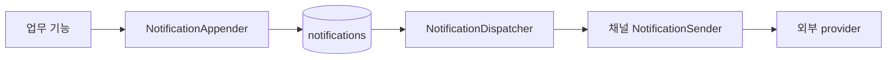

# 알림 추가 가이드

- 기준: 현재 구현
- 목적: 새 알림의 적재 방식과 책임 경계를 빠르게 결정한다.
- 민감한 운영 설정값은 문서나 로그에 기록하지 않는다.

## 핵심 규칙

1. 업무 기능은 수신 대상·발송 시각·템플릿 변수를 결정하고 provider를 직접 호출하지 않는다.
2. 공통 발송 대상은 `notifications`에 저장한다. 한 행은 수신자 한 명·채널 한 개·논리 알림 한 건이다.
3. `deduplication_key`는 같은 논리 알림의 재처리에도 변하지 않게 만든다. 별도 회차로 다시 보낼 때는 회차 식별자를 포함한다.
4. 발송 결과 상태는 `PENDING → SENT | FAILED | UNKNOWN`이다. `SENT`는 provider 접수, `FAILED`는 명시적 거절, `UNKNOWN`은 접수 여부를 판단할 수 없는 결과다. `SENT`는 사용자 도착을 뜻하지 않는다.
5. dispatcher는 `max(scheduled_at, created_at)`이 현재 시각 기준 최근 8분 이내인 due `PENDING`만 조회한다. 지연 적재된 행은 적재 시각부터 창을 적용하고, 그보다 오래된 행은 `PENDING`으로 남겨 자동 발송하지 않는다.
6. provider 호출·요청/응답 변환은 채널 sender가 맡고, dispatcher에는 채널별 분기 로직을 추가하지 않는다.
7. `SENT`·`FAILED`·`UNKNOWN`은 terminal 상태로 자동 재발송하지 않고 30일 후 정리한다. `PENDING`은 자동 정리하지 않는다. 삭제된 행의 중복 키는 다시 사용할 수 있다.

## 알림 유형별 적재 방식

| 상황 | 구현 규칙 | 참고 구현 |
| --- | --- | --- |
| 이벤트 알림, 적재 유실 허용 | 커밋 후 listener에서 전용 실행기로 전달하고 `appendInNewTransaction` 호출 | 가입 알림 |
| 업무 변경과 알림 행을 함께 저장 | 업무 트랜잭션 안에서 `append` 호출. 알림 저장 실패 시 업무도 롤백 | 공통 appender |
| 적재 유실을 허용할 수 없음 | 현재 AFTER_COMMIT 실행기를 쓰지 않는다. transactional outbox 등 내구성 설계를 먼저 추가 | 현재 미구현 |
| 미래 시각·다수 대상 | 업무 소유 API에서 대상과 시각을 계산하고 페이지별 `appendAll` 사용 | 스크랩 리마인드 |

**선택 기준:** 이벤트 처리인지 예약 대상 평가인지 먼저 결정한다. 채널과 템플릿 선택은 별도 결정이다. 예를 들어 FCM 예약 알림은 예약형 적재와 FCM sender가 모두 필요하다.

## 구현 규칙

### 적재와 중복 방지

- API 모듈은 `NotificationAppender`를 사용하고 Repository/JPA Entity를 직접 조작하지 않는다.
- `append`·`appendAll`은 호출자의 트랜잭션에 참여한다. 한 번의 적재를 원자적으로 저장할 때 사용한다.
- `appendInNewTransaction`은 호출자와 분리된 저장이 필요한 경우에만 사용한다. 가입 알림은 커밋 후 전용 실행기에서 호출하므로 프로세스 종료 시 적재가 유실될 수 있다.
- `deduplication_key`의 DB unique 제약을 최종 중복 방지 수단으로 유지한다. 선행 조회 뒤 동시 insert가 경합하면 해당 배치 트랜잭션이 롤백될 수 있으며, 현재 별도 무시·복구 처리는 하지 않는다. `INSERT IGNORE`는 중복 키 외 오류까지 경고로 낮출 수 있으므로 기본 대안으로 쓰지 않는다.
- 주소와 payload 원문은 로그에 남기지 않는다.

### 예약형 알림

- 대상 자격, 예정 시각, 늦은 실행, 취소·변경 정책은 해당 업무 기능이 소유한다.
- 재시작 시 `notifications` 행이 진행 기록으로 충분하면 별도 일정/커서 테이블을 만들지 않는다. 공고 리마인드의 D-1은 `jobs.recruitment_end_at - 24시간`으로 조회 시 계산하고, 안정적인 알림 키에 이 시각을 포함한다. D-1이 지났더라도 실제 마감 전이면 기존 적격 스크랩을 처리하며, D-1 이후 새로 활성화한 스크랩은 `active_since`로 제외한다.
- scheduler는 소유 API의 `ScheduledJobDefinition`과 `@SchedulerLock`을 사용한다. 실행 주기와 활성화는 `scheduled_jobs`에서 관리한다.
- 페이지 커서는 한 scheduler 실행 안에서만 유지한다. 재실행은 처음부터 조회하되, 이미 적재된 알림은 중복 키와 `notifications` 조회로 건너뛴다. provider 호출은 적재 트랜잭션 밖에서 한다.

### 템플릿과 채널

- 같은 채널의 새 템플릿은 새 알림 적재 로직만 추가하고 기존 sender를 재사용한다. 승인된 `templateCode`와 payload 키를 일치시킨다.
- NHN 템플릿 본문은 provider에 둔다. 애플리케이션은 template code와 변수만 전달한다.
- 새 채널은 `NotificationChannel`과 해당 채널의 `NotificationSender`·provider adapter·설정·오류 변환을 추가한다. dispatcher 수정은 필요하지 않도록 유지한다.
- sender 미등록 채널은 `CHANNEL_NOT_CONFIGURED`로 실패한다. enum 값만 추가해도 발송되지는 않는다.
- provider 결과는 원본 `result_code`와 공통 의미 `result_category`를 함께 저장한다. 의미가 확인된 명시적 거절은 `FAILED`, 접수 여부가 불명확한 응답은 `UNKNOWN`으로 기록하며 둘 다 자동 재발송하지 않는다. provider 응답 메시지 원문은 저장·로그하지 않는다.
- NHN의 현재 코드표는 API 요청 응답 코드만 분류한다. `SENT`는 NHN 접수이며, NHN→카카오 실제 전달 결과 코드는 조회하지 않는다.
- 채널의 멱등성·재시도 정책은 해당 provider 특성으로 검토한다. 현재 공통 자동 재시도는 없다.

| 코드/응답 | 저장 분류 | 해석 |
| --- | --- | --- |
| NHN `-1005` | `UNKNOWN` / `DUPLICATE_REQUEST` | 같은 멱등성 키 응답만으로는 최초 요청의 접수 여부를 확인할 수 없음 |
| NHN `-1000`, `-1001` | `FAILED` / `AUTHENTICATION_CONFIGURATION` | 앱키·비밀 키 설정 오류로 명시적 거절 |
| NHN `-3003` ~ `-3005` | `FAILED` / `TEMPLATE_CONFIGURATION` | 템플릿 없음·파라미터·승인 상태 오류로 명시적 거절 |
| HTTP `429` / 일반 `4xx` | `FAILED` / `RATE_LIMITED`·`HTTP_ERROR` | provider의 명시적 요청 거절 |
| HTTP `5xx`, 통신·client 예외, 해석 불가 응답 | `UNKNOWN` / 해당 `result_category` | provider 접수 여부를 확인할 수 없음 |
| 미등록 NHN 코드 | `UNKNOWN` / `UNKNOWN_PROVIDER_ERROR` | 원본 코드는 보존하지만 의미를 확인할 수 없어 재발송하지 않음 |

## 운영상 한계

- `/actuator/metrics`는 `127.0.0.1` 요청만 허용한다. 적재·발송 카운터는 인스턴스별 누적값이고, 대기량 gauge는 공용 DB를 조회한다.
- 카운터는 재시작 시 초기화되며, 시간대별 대시보드와 자동 경보는 구성되어 있지 않다.
- 발송 창을 지난 `PENDING`은 자동 발송·정리하지 않는다. `UNKNOWN`도 자동 재발송하지 않으므로 결과 확인과 후속 판단은 운영에서 수행한다.

## 패키지 컨벤션

- 도메인 대상 조회·projection: 대상 도메인의 core 패키지 (채용공고 리마인드는 `ogonggo-core/job`)
- 알림 대상 정책·예정 시각·payload 구성: 소유 API의 `notification/intake`
- 공통 모델·적재 계약·발송 결과·저장소: `ogonggo-core/notification` (intake, delivery, persistence)
- polling·dispatcher·sender 계약·정리 scheduler: 소유 API의 `notification/delivery`
- 채널별 provider client·요청/응답 DTO·인증 설정·sender 구현: 소유 API의 `notification/channel/<channel>`
- Actuator 지표: 소유 API의 `notification/metrics`
- scheduler 정의는 소유 API의 `config`, 실행 주기와 활성 상태는 `scheduled_jobs`

## 새 알림 체크리스트

- [ ] 유실 허용 여부와 적재 방식(커밋 후 / 업무 트랜잭션 / 예약형)을 정했는가?
- [ ] 수신 대상·예정 시각·취소/변경 규칙을 업무 기능에 두었는가?
- [ ] 안정적인 `deduplication_key`, 채널, template code, payload, 수신 주소를 준비했는가?
- [ ] 대상 선정·payload·중복 실행·트랜잭션 경계 테스트를 작성했는가?
- [ ] provider 성공/실패와 미등록 채널 처리를 테스트했는가?
- [ ] scheduler나 스키마가 필요하면 작업 행·enabled 상태·SQL 배포 순서를 확인했는가?

테스트는 한국어 `@DisplayName`, 백틱 함수명, `// given / when / then`을 사용한다. 세부 규칙은 [테스트 작성 가이드](testing.md)를 따른다.

## 현재 구현상 유의점

- 실제 발송 sender는 `KAKAO`만 구현되어 있다. `EMAIL`·`FCM`은 enum/확장 경계만 있다.
- 스크랩 리마인드 scheduler는 템플릿 승인 전까지 코드 등록이 보류되어 있어 현재 실행되지 않는다.
- 템플릿 코드는 알림 행의 `template_code`를 사용한다. `nhn.templateCode`는 호환용 설정이다.
- NHN 멱등성은 provider의 단기 중복 억제일 뿐 애플리케이션 재시도 정책이 아니다. provider 접수 이후 사용자 도착 여부도 현재 추적하지 않는다.
- `max(scheduled_at, created_at)` 기준 최근 8분 이내의 due `PENDING`만 dispatcher가 읽는다. NHN 멱등성 10분보다 2분 짧게 잘라 결과 저장 실패 후 재호출 가능 구간을 제한한다. 늦게 적재된 D-1 알림은 적재 시각부터 처리 창을 적용한다. 두 시각 모두 8분을 넘긴 행은 상태를 바꾸거나 삭제하지 않고 남겨 운영 조회 대상으로 둔다.
- dispatcher 전체 ShedLock은 최대 90초다. 실행이 끝날 때 60초 이상 걸렸으면 경고 로그를 남기며, 반복되면 lock 시간을 늘릴 운영 신호로 본다. 행별 claim은 없으므로 만료된 lock과 장시간 정지 상황까지 수학적으로 중복 발송을 막는 보장은 아니다.

## 기준 코드

- 적재 계약: [NotificationAppender](../../ogonggo-core/src/main/kotlin/com/ogonggo/core/notification/intake/implement/NotificationAppender.kt), [NotificationAppendDto](../../ogonggo-core/src/main/kotlin/com/ogonggo/core/notification/intake/implement/dto/NotificationAppendDto.kt)
- 가입 이벤트: [UserSignUpAlimTalkEventListener](../../ogonggo-api-user/src/main/kotlin/com/ogonggo/userapi/notification/intake/implement/signup/UserSignUpAlimTalkEventListener.kt)
- 예약형 적재: [JobBookmarkReminderEnqueueService](../../ogonggo-api-user/src/main/kotlin/com/ogonggo/userapi/notification/intake/business/JobBookmarkReminderEnqueueService.kt), [JobBookmarkReminderScheduler](../../ogonggo-api-user/src/main/kotlin/com/ogonggo/userapi/notification/intake/implement/reminder/JobBookmarkReminderScheduler.kt)
- 발송 확장: [NotificationDispatcher](../../ogonggo-api-user/src/main/kotlin/com/ogonggo/userapi/notification/delivery/implement/NotificationDispatcher.kt), [NotificationSender](../../ogonggo-api-user/src/main/kotlin/com/ogonggo/userapi/notification/delivery/implement/NotificationSender.kt), [KakaoNotificationSender](../../ogonggo-api-user/src/main/kotlin/com/ogonggo/userapi/notification/channel/alimtalk/KakaoNotificationSender.kt)
- 운영 주기: [스케줄 작업 가이드](scheduling.md), [시간 처리 가이드](time-handling.md)
