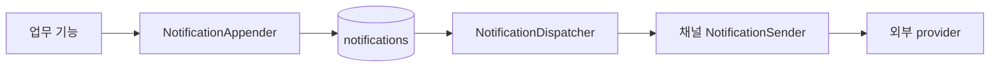

# 알림 추가 가이드

- 기준: 현재 구현
- 목적: 새 알림의 적재 방식과 책임 경계를 빠르게 결정한다.
- 민감한 운영 설정값은 문서나 로그에 기록하지 않는다.

## 핵심 규칙

1. 업무 기능은 수신 대상·발송 시각·템플릿 변수를 결정하고 provider를 직접 호출하지 않는다.
2. 공통 발송 대상은 `notifications`에 저장한다. 한 행은 수신자 한 명·채널 한 개·논리 알림 한 건이다.
3. `deduplication_key`는 같은 논리 알림의 재처리에도 변하지 않게 만든다. 별도 회차로 다시 보낼 때는 회차 식별자를 포함한다.
4. 발송 결과 상태는 `PENDING → SENT | FAILED | UNKNOWN`이다. `SENT`는 provider 접수, `FAILED`는 명시적 거절, `UNKNOWN`은 접수 여부를 판단할 수 없는 결과다. `SENT`는 사용자 도착을 뜻하지 않는다.
5. dispatcher는 `max(scheduled_at, created_at)`이 현재 시각 기준 최근 8분 이내인 due `PENDING`만 조회한다. 지연 적재된 행은 적재 시각부터 창을 적용하고, 그보다 오래된 행은 `PENDING`으로 남겨 자동 발송하지 않는다.
6. provider 호출·요청/응답 변환은 채널 sender가 맡고, dispatcher에는 채널별 분기 로직을 추가하지 않는다.
7. `SENT`·`FAILED`·`UNKNOWN`은 terminal 상태로 자동 재발송하지 않고 30일 후 정리한다. `PENDING`은 자동 정리하지 않는다. 삭제된 행의 중복 키는 다시 사용할 수 있다.



## 알림 유형별 적재 방식

| 상황 | 구현 규칙 | 참고 구현 |
| --- | --- | --- |
| 이벤트 알림, 적재 유실 허용 | 커밋 후 listener에서 전용 실행기로 전달하고 `appendInNewTransaction` 호출 | 가입 알림 |
| 업무 변경과 알림 행을 함께 저장 | 업무 트랜잭션 안에서 `append` 호출. 알림 저장 실패 시 업무도 롤백 | 공통 appender |
| 적재 유실을 허용할 수 없음 | 현재 AFTER_COMMIT 실행기를 쓰지 않는다. transactional outbox 등 내구성 설계를 먼저 추가 | 현재 미구현 |
| 미래 시각·다수 대상 | 업무 소유 API에서 대상과 시각을 계산하고 페이지별 `appendAll` 사용 | 스크랩 리마인드 |

**선택 기준:** 이벤트 처리인지 예약 대상 평가인지 먼저 결정한다. 채널과 템플릿 선택은 별도 결정이다. 예를 들어 FCM 예약 알림은 예약형 적재와 FCM sender가 모두 필요하다.

### FCM 설정과 payload

FCM sender를 활성화하려면 사용자 API 설정에 Firebase Admin SDK 인증 정보를 넣는다. `credentials-path`가 없으면 Google Application Default Credentials를 사용한다.

```yaml
ogonggo:
  firebase:
    enabled: true
    credentials-path: /secure/path/firebase-service-account.json
```

서비스 계정 JSON은 저장소에 커밋하지 않는다. 로컬에서는 `be/firebase` 아래 파일을 사용할 수 있지만 `GOOGLE_APPLICATION_CREDENTIALS` 또는 배포 환경 Secret으로 주입하는 방식을 우선한다.

FCM 알림의 `payload_json`은 다음 형태다. `data`는 Firebase 메시지 데이터 규칙에 맞춰 문자열 값만 사용한다.

```json
{
  "title": "마감 임박",
  "body": "스크랩한 공고가 내일 마감됩니다.",
  "data": {"jobId": "7"}
}
```

## 구현 규칙

### 적재와 중복 방지

- API 모듈은 `NotificationAppender`를 사용하고 Repository/JPA Entity를 직접 조작하지 않는다.
- `append`·`appendAll`은 호출자의 트랜잭션에 참여한다. 한 번의 적재를 원자적으로 저장할 때 사용한다.
- `appendInNewTransaction`은 호출자와 분리된 저장이 필요한 경우에만 사용한다. 가입 알림은 커밋 후 전용 실행기에서 호출하므로 프로세스 종료 시 적재가 유실될 수 있다.
- `deduplication_key`의 DB unique 제약을 최종 중복 방지 수단으로 유지한다. 선행 조회 뒤 동시 insert가 경합하면 해당 배치 트랜잭션이 롤백될 수 있으며, 현재 별도 무시·복구 처리는 하지 않는다. `INSERT IGNORE`는 중복 키 외 오류까지 경고로 낮출 수 있으므로 기본 대안으로 쓰지 않는다.
- 주소와 payload 원문은 로그에 남기지 않는다.

### 예약형 알림

- 대상 자격, 예정 시각, 늦은 실행, 취소·변경 정책은 해당 업무 기능이 소유한다.
- 재시작 시 `notifications` 행이 진행 기록으로 충분하면 별도 일정/커서 테이블을 만들지 않는다. 공고 리마인드의 D-1은 `jobs.recruitment_end_at - 24시간`으로 조회 시 계산하고, 안정적인 알림 키에 이 시각을 포함한다. D-1이 지났더라도 실제 마감 전이면 기존 적격 스크랩을 처리하며, D-1 이후 새로 활성화한 스크랩은 `active_since`로 제외한다.
- scheduler는 소유 API의 `ScheduledJobDefinition`과 `@SchedulerLock`을 사용한다. 실행 주기와 활성화는 `scheduled_jobs`에서 관리한다.
- 페이지 커서는 한 scheduler 실행 안에서만 유지한다. 재실행은 처음부터 조회하되, 이미 적재된 알림은 중복 키와 `notifications` 조회로 건너뛴다. provider 호출은 적재 트랜잭션 밖에서 한다.

### 템플릿과 채널

- 같은 채널의 새 템플릿은 새 알림 적재 로직만 추가하고 기존 sender를 재사용한다. 승인된 `templateCode`와 payload 키를 일치시킨다.
- NHN 템플릿 본문은 provider에 둔다. 애플리케이션은 template code와 변수만 전달한다.
- 새 채널은 `NotificationChannel`과 해당 채널의 `NotificationSender`·provider adapter·설정·오류 변환을 추가한다. dispatcher 수정은 필요하지 않도록 유지한다.
- sender 미등록 채널은 `CHANNEL_NOT_CONFIGURED`로 실패한다. enum 값만 추가해도 발송되지는 않는다.
- provider 결과는 원본 `result_code`와 공통 의미 `result_category`를 함께 저장한다. 의미가 확인된 명시적 거절은 `FAILED`, 접수 여부가 불명확한 응답은 `UNKNOWN`으로 기록하며 둘 다 자동 재발송하지 않는다. provider 응답 메시지 원문은 저장·로그하지 않는다.
- NHN의 현재 코드표는 API 요청 응답 코드만 분류한다. `SENT`는 NHN 접수이며, NHN→카카오 실제 전달 결과 코드는 조회하지 않는다.
- 채널의 멱등성·재시도 정책은 해당 provider 특성으로 검토한다. 현재 공통 자동 재시도는 없다.

| 코드/응답 | 저장 분류 | 해석 |
| --- | --- | --- |
| NHN `-1005` | `UNKNOWN` / `DUPLICATE_REQUEST` | 같은 멱등성 키 응답만으로는 최초 요청의 접수 여부를 확인할 수 없음 |
| NHN `-1000`, `-1001` | `FAILED` / `AUTHENTICATION_CONFIGURATION` | 앱키·비밀 키 설정 오류로 명시적 거절 |
| NHN `-3003` ~ `-3005` | `FAILED` / `TEMPLATE_CONFIGURATION` | 템플릿 없음·파라미터·승인 상태 오류로 명시적 거절 |
| HTTP `429` / 일반 `4xx` | `FAILED` / `RATE_LIMITED`·`HTTP_ERROR` | provider의 명시적 요청 거절 |
| HTTP `5xx`, 통신·client 예외, 해석 불가 응답 | `UNKNOWN` / 해당 `result_category` | provider 접수 여부를 확인할 수 없음 |
| 미등록 NHN 코드 | `UNKNOWN` / `UNKNOWN_PROVIDER_ERROR` | 원본 코드는 보존하지만 의미를 확인할 수 없어 재발송하지 않음 |

### 선택 운영 지표 (Actuator)

- Actuator `health`와 `metrics` endpoint를 등록한다. `/health` 컨트롤러는 `HealthEndpoint`를 사용하며, Actuator 자체 `health` 경로는 Security에서 차단한다. `metrics`만 loopback 요청을 허용해 외부에서 접근할 수 없고 컨테이너 내부(ECS Exec 등)에서 `127.0.0.1:8080`으로 조회한다.
- 적재·발송 카운터는 프로세스 시작 이후의 누적값이며 인스턴스별이다. 구간별 처리량은 같은 인스턴스에서 두 번 조회해 차이를 본다. 재시작 전 이력은 `notifications`에 30일간 남는 결과 상태로 확인한다.
- 대기 gauge는 DB를 조회한다. `total`은 전체 `PENDING`, `due`는 `max(scheduled_at, created_at)` 기준 8분 발송 창, `expired`는 두 시각 모두 창을 넘긴 건, `future`는 예정 시각 전 건수다. 여러 인스턴스에서 조회한 backlog는 같은 DB 잔량이므로 합산하지 않는다.
- Prometheus/Grafana 없이도 현재값과 누적량을 확인할 수 있지만, 시간대별 추세·자동 경보는 제공하지 않는다.

```bash
curl -s 'http://127.0.0.1:8080/actuator/metrics/ogonggo.notification.enqueued?tag=channel:KAKAO'
curl -s 'http://127.0.0.1:8080/actuator/metrics/ogonggo.notification.delivery?tag=outcome:FAILED&tag=failure_category:RATE_LIMITED'
curl -s 'http://127.0.0.1:8080/actuator/metrics/ogonggo.notification.pending?tag=state:due'
curl -s 'http://127.0.0.1:8080/actuator/metrics/ogonggo.notification.pending?tag=state:expired'
```

## 운영 대응

확인 순서는 **CloudWatch Logs Insights에서 실행·오류를 확인하고 DB에서 현재 상태와 잔량을 조회하는 것**이다. Actuator `metrics`는 컨테이너 내부 loopback 전용이므로 ECS에서 직접 조회할 때만 보조 지표로 사용한다. 프로세스 카운터는 재시작 시 초기화되며, DB backlog는 공유 잔량이므로 인스턴스별로 합산하지 않는다.

- NHN HTTP 429(rate limit) 실패가 늘어남
  - 확인법: CloudWatch Logs Insights에서 NHN 요청 결과 로그를 집계한다. 이 로그는 DB 결과 기록보다 먼저 남으므로 결과 저장 실패 건도 provider 응답 기준 집계에 포함된다.
  ```sql
  fields @timestamp, @message
  | filter @message like /NHN 알림톡 요청 결과/
  | parse @message /failureCategory=(?<failureCategory>[^, ]+), resultCode=(?<resultCode>[^, ]+)/
  | filter failureCategory = "RATE_LIMITED" or resultCode = "NHN_HTTP_429"
  | stats count(*) as failures by bin(5m), failureCategory, resultCode
  ```
  - 컨테이너 내부의 프로세스별 누적값이 필요할 때만 Actuator를 보조로 조회한다.
  ```bash
  curl -s 'http://127.0.0.1:8080/actuator/metrics/ogonggo.notification.delivery?tag=channel:KAKAO&tag=outcome:FAILED&tag=failure_category:RATE_LIMITED'
  ```
  - `RATE_LIMITED`는 저장된 공통 실패 분류이고, `NHN_HTTP_429`는 현재 HTTP 429의 원본 코드다. NHN 응답 본문 내부 코드가 rate limit으로 추가 확인되면 해당 코드도 별도로 필터링한다. 자동 경보는 아직 없다.

- 적재량 대비 발송 처리량이 낮아짐
  - 확인법: 같은 인스턴스에서 아래 적재 카운터와 발송 결과 카운터를 동일한 간격으로 두 번 조회한다. 각 카운터의 두 조회값 차이가 해당 구간의 처리 건수다. 단순 적재·발송량 비교만으로 정상 지연과 적체를 구분하지 말고 아래 backlog도 함께 본다.
  ```bash
  curl -s 'http://127.0.0.1:8080/actuator/metrics/ogonggo.notification.enqueued?tag=channel:KAKAO'
  curl -s 'http://127.0.0.1:8080/actuator/metrics/ogonggo.notification.delivery?tag=channel:KAKAO&tag=outcome:SENT'
  curl -s 'http://127.0.0.1:8080/actuator/metrics/ogonggo.notification.delivery?tag=channel:KAKAO&tag=outcome:FAILED'
  curl -s 'http://127.0.0.1:8080/actuator/metrics/ogonggo.notification.delivery?tag=channel:KAKAO&tag=outcome:UNKNOWN'
  curl -s 'http://127.0.0.1:8080/actuator/metrics/ogonggo.notification.delivery?tag=channel:KAKAO&tag=outcome:UNRESOLVED'
  ```
  - `UNRESOLVED`는 provider 결과를 DB에 확정하지 못한 건이다. 이 카운터는 DB에 기록된 발송 결과 수와 다를 수 있으므로, 값이 증가하면 관련 dispatcher 오류 로그와 `PENDING` 잔량을 확인한다.

- 발송 대기 잔량이 증가함
  - 확인법: 전체 `PENDING`, 현재 발송 가능 창, 8분 발송 창 초과, 아직 예정 시각 전인 건을 각각 조회한다.
  ```bash
  curl -s 'http://127.0.0.1:8080/actuator/metrics/ogonggo.notification.pending?tag=state:total'
  curl -s 'http://127.0.0.1:8080/actuator/metrics/ogonggo.notification.pending?tag=state:due'
  curl -s 'http://127.0.0.1:8080/actuator/metrics/ogonggo.notification.pending?tag=state:expired'
  curl -s 'http://127.0.0.1:8080/actuator/metrics/ogonggo.notification.pending?tag=state:future'
  ```
  - `due`가 계속 쌓이면 dispatcher 실행 요약, 실행기 포화 로그와 provider 실패를 확인한다. `future`는 아직 발송 예정 시각이 되지 않은 정상 대기일 수 있다.

- dispatcher 발송 창을 넘긴 `PENDING` 행을 조사함
  - 확인법: 아래 조회는 `scheduled_at`과 `created_at`이 모두 현재보다 8분 이상 지난 `PENDING`이다. 이 행들은 자동 발송 대상에서 제외되며 자동 삭제·재시도되지 않는다. 프로세스 중단, provider 응답 이후 DB 결과 기록 실패, 처리 지연 등 여러 원인이 가능하므로 결과를 곧바로 특정 장애로 단정하지 않는다.
  ```sql
  SELECT
      id,
      channel,
      scheduled_at,
      created_at,
      updated_at,
      result_code,
      result_category,
      TIMESTAMPDIFF(MINUTE, GREATEST(scheduled_at, created_at), NOW(6)) AS overdue_minutes
  FROM notifications
  WHERE status = 'PENDING'
    AND scheduled_at <= NOW(6) - INTERVAL 8 MINUTE
    AND created_at <= NOW(6) - INTERVAL 8 MINUTE
  ORDER BY scheduled_at, id;
  ```
  - 건수만 빠르게 확인하려면 `expired` gauge를 본다. 개별 행의 수신자 주소와 payload는 운영 로그나 공유 문서에 복사하지 않는다.

- 실패·접수 여부 미확정 사유를 DB에서 추적함
  - 확인법: 최근 24시간 동안 최종 상태로 기록된 실패·미확정 결과를 원인별로 집계한다. `result_code`는 채널 원본 코드, `result_category`는 공통 분류다.
  ```sql
  SELECT
      status,
      result_category,
      result_code,
      COUNT(*) AS notification_count
  FROM notifications
  WHERE status IN ('FAILED', 'UNKNOWN')
    AND updated_at >= NOW(6) - INTERVAL 24 HOUR
  GROUP BY status, result_category, result_code
  ORDER BY notification_count DESC;
  ```
  - `UNKNOWN`은 타임아웃·통신 오류·5xx·중복 멱등성 키 응답 등 접수 여부를 확정할 수 없는 결과다. `FAILED`와 `UNKNOWN` 모두 자동 재발송하지 않는다. 터미널 행은 30일 보관 후 정리되므로 더 긴 이력은 로그 보존 기간에서 조회한다.

- 가입 알림 적재 누락을 조사함
  - 확인법: 가입 알림 적재는 가입 커밋 뒤 비동기로 수행되고, 적재 카운터는 커밋된 알림 행만 증가한다. 가입 직후 누락이 의심되면 CloudWatch Logs Insights에서 해당 시간대의 `가입 알림 적재` 오류를 찾는다. 적재기 포화에 따른 건너뜀, 알림 준비 실패, 저장 예외는 각각 로그에 남는다. 이 경로의 드문 유실은 정책상 허용되며, 현재 별도 영속 재처리 큐는 없다.
  ```sql
  fields @timestamp, @message
  | filter @message like /가입 알림 적재 실행기가 포화/
      or @message like /가입 알림 적재 작업을 등록하지 못했습니다/
      or @message like /가입 알림을 적재하지 못했습니다/
  | sort @timestamp desc
  ```

- dispatcher가 오래 걸리거나 전용 실행기가 포화됨
  - 확인법: CloudWatch Logs Insights에서 dispatcher 실행 요약과 60초 이상 지연 경고를 조회한다. 경고는 실행이 끝난 뒤 기록된다. 60초는 조사 신호이며 ShedLock은 90초 만료다. 실제 실행이 90초를 넘어 lock이 풀리면 다른 인스턴스가 같은 행을 읽을 수 있어 중복 요청 위험이 커진다. 행별 claim은 없다.
  ```sql
  fields @timestamp, @message
  | filter @message like /알림 dispatcher 실행이 60초 이상 걸렸습니다/
      or @message like /알림 전용 실행기가 포화되어 남은 대기 건을 다음 실행으로 넘깁니다/
  | sort @timestamp desc
  ```
  - 실행별 `sent`, `failed`, `unknown`, `unresolved`, `executorRejected`, `durationMs` 추이를 집계하려면:
  ```sql
  fields @timestamp, @message
  | filter @message like /알림 발송 실행 완료/
  | parse @message /sent=(?<sent>[0-9]+), failed=(?<failed>[0-9]+), unknown=(?<unknown>[0-9]+), unresolved=(?<unresolved>[0-9]+), executorRejected=(?<executorRejected>true|false), durationMs=(?<durationMs>[0-9]+)/
  | stats count(*) as runs, sum(sent) as sent, sum(failed) as failed, sum(unknown) as unknown, sum(unresolved) as unresolved, max(durationMs) as maxDurationMs by bin(5m)
  ```

- 동일 `deduplication_key` 동시 적재로 배치 저장이 실패함
  - DB unique 제약이 중복 행을 막지만 해당 배치 전체가 롤백될 수 있다. 전용 경고 로그에 배치 후보 수(`batchSize`)를 남기며 자동 재실행하지 않는다.

- 30일 정리 작업이 밀리거나 삭제량이 급증함
  - 확인법: 매일 정리 작업 로그의 `deletedCount`와 `timeBudgetReached`를 확인한다. 한 번에 최대 500건씩, 최대 45초 동안 삭제한다. `timeBudgetReached=true`가 반복되면 남은 양이나 삭제 비용을 별도로 확인한다. 정리된 행의 `deduplication_key`도 사라져 30일 이후 동일 논리 이벤트가 다시 들어오면 재등록될 수 있으며, 이 가능성은 허용한다.
  ```sql
  fields @timestamp, @message
  | filter @message like /오래된 알림 정리 완료/
  | parse @message /deletedCount=(?<deletedCount>[0-9]+), timeBudgetReached=(?<timeBudgetReached>true|false)/
  | stats sum(deletedCount) as deleted, max(deletedCount) as maxDeletedPerRun, count(*) as runs by bin(1d), timeBudgetReached
  | sort @timestamp desc
  ```

- 리마인드 대상 적재 실행량·실패를 확인함
  - 확인법: 템플릿 승인 전에는 리마인드 scheduler가 등록되어 있지 않아 아래 로그가 나타나지 않는 것이 정상이다. 활성화 후에는 `workItems`, `candidates`, `queued`, `skipped`, `timeBudgetReached`를 실행 요약에서 비교하고, 실패 로그의 `errorType`을 확인한다.
  ```sql
  fields @timestamp, @message
  | filter @message like /리마인드 대상 적재 완료/
      or @message like /리마인드 대상 적재 실패/
  | sort @timestamp desc
  ```

**아직 없는 운영 기능:** Actuator 지표 조회는 가능하지만 시간대별 보존 대시보드와 자동 경보는 구성돼 있지 않다. DB unique 경합 전용 카운터도 없다. 따라서 위 확인은 운영자가 인스턴스 내부 Actuator, CloudWatch Logs Insights, DB 조회를 조합해 수행한다.

## 패키지 컨벤션

- 업무 대상·시각·payload 구성: 소유 API의 `notification/intake` 기능 패키지
- 공통 알림 모델·적재 계약·저장소: `ogonggo-core/notification`
- polling·발송 결과 기록·정리: 소유 API의 `notification/delivery`
- provider client·요청/응답 DTO·인증 설정: `notification/channel/<channel>`
- scheduler 등록: 소유 API의 `config`, 실행 주기·활성 상태: `scheduled_jobs`

## 새 알림 체크리스트

- [ ] 유실 허용 여부와 적재 방식(커밋 후 / 업무 트랜잭션 / 예약형)을 정했는가?
- [ ] 수신 대상·예정 시각·취소/변경 규칙을 업무 기능에 두었는가?
- [ ] 안정적인 `deduplication_key`, 채널, template code, payload, 수신 주소를 준비했는가?
- [ ] 대상 선정·payload·중복 실행·트랜잭션 경계 테스트를 작성했는가?
- [ ] provider 성공/실패와 미등록 채널 처리를 테스트했는가?
- [ ] scheduler나 스키마가 필요하면 작업 행·enabled 상태·SQL 배포 순서를 확인했는가?

테스트는 한국어 `@DisplayName`, 백틱 함수명, `// given / when / then`을 사용한다. 세부 규칙은 [테스트 작성 가이드](testing.md)를 따른다.

## 현재 구현상 유의점

- 실제 발송 sender는 `KAKAO`와 설정이 활성화된 `FCM`이다. FCM 토큰은 `PUT /api/v1/users/me/fcm-token`으로 저장하고, 알림 행의 `recipient_address`에 대상 토큰을 넣어 발송한다. `EMAIL`은 enum/확장 경계만 있다.
- 스크랩 리마인드 scheduler는 템플릿 승인 전까지 코드 등록이 보류되어 있어 현재 실행되지 않는다.
- 템플릿 코드는 알림 행의 `template_code`를 사용한다. `nhn.templateCode`는 호환용 설정이다.
- NHN 멱등성은 provider의 단기 중복 억제일 뿐 애플리케이션 재시도 정책이 아니다. provider 접수 이후 사용자 도착 여부도 현재 추적하지 않는다.
- `max(scheduled_at, created_at)` 기준 최근 8분 이내의 due `PENDING`만 dispatcher가 읽는다. NHN 멱등성 10분보다 2분 짧게 잘라 결과 저장 실패 후 재호출 가능 구간을 제한한다. 늦게 적재된 D-1 알림은 적재 시각부터 처리 창을 적용한다. 두 시각 모두 8분을 넘긴 행은 상태를 바꾸거나 삭제하지 않고 남겨 운영 조회 대상으로 둔다.
- dispatcher 전체 ShedLock은 최대 90초다. 실행이 끝날 때 60초 이상 걸렸으면 경고 로그를 남기며, 반복되면 lock 시간을 늘릴 운영 신호로 본다. 행별 claim은 없으므로 만료된 lock과 장시간 정지 상황까지 수학적으로 중복 발송을 막는 보장은 아니다.

## 기준 코드

- 적재 계약: [NotificationAppender](../../ogonggo-core/src/main/kotlin/com/ogonggo/core/notification/intake/implement/NotificationAppender.kt), [NotificationAppendDto](../../ogonggo-core/src/main/kotlin/com/ogonggo/core/notification/intake/implement/dto/NotificationAppendDto.kt)
- 가입 이벤트: [UserSignUpAlimTalkEventListener](../../ogonggo-api-user/src/main/kotlin/com/ogonggo/userapi/notification/intake/implement/signup/UserSignUpAlimTalkEventListener.kt)
- 예약형 적재: [JobBookmarkReminderEnqueueService](../../ogonggo-api-user/src/main/kotlin/com/ogonggo/userapi/notification/intake/business/JobBookmarkReminderEnqueueService.kt), [JobBookmarkReminderScheduler](../../ogonggo-api-user/src/main/kotlin/com/ogonggo/userapi/notification/intake/implement/reminder/JobBookmarkReminderScheduler.kt)
- 발송 확장: [NotificationDispatcher](../../ogonggo-api-user/src/main/kotlin/com/ogonggo/userapi/notification/delivery/implement/NotificationDispatcher.kt), [NotificationSender](../../ogonggo-api-user/src/main/kotlin/com/ogonggo/userapi/notification/delivery/implement/NotificationSender.kt), [KakaoNotificationSender](../../ogonggo-api-user/src/main/kotlin/com/ogonggo/userapi/notification/channel/alimtalk/KakaoNotificationSender.kt)
- FCM 토큰·sender: [FcmTokenController](../../ogonggo-api-user/src/main/kotlin/com/ogonggo/userapi/notification/fcm/presentation/FcmTokenController.kt), [FcmNotificationSender](../../ogonggo-api-user/src/main/kotlin/com/ogonggo/userapi/notification/fcm/implement/FcmNotificationSender.kt)
- 운영 주기: [스케줄 작업 가이드](scheduling.md), [시간 처리 가이드](time-handling.md)
