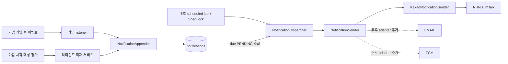
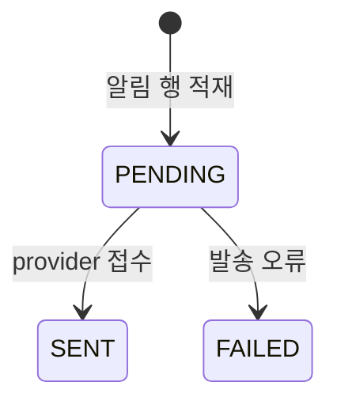
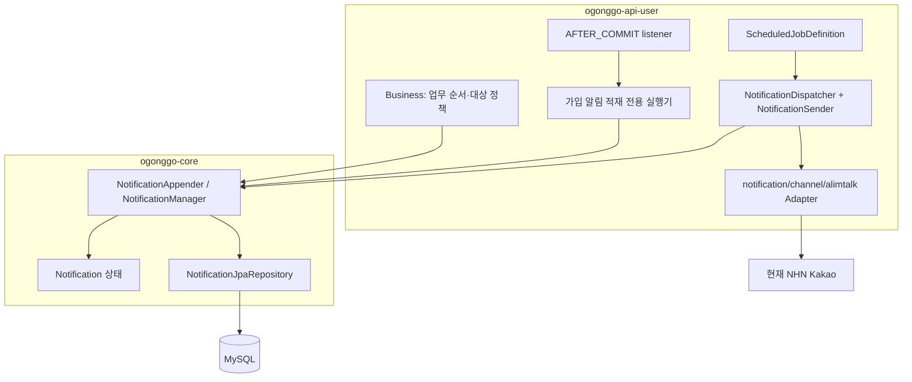
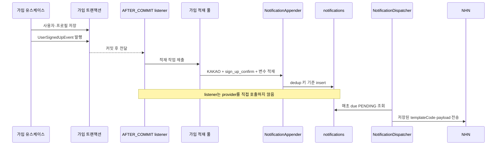
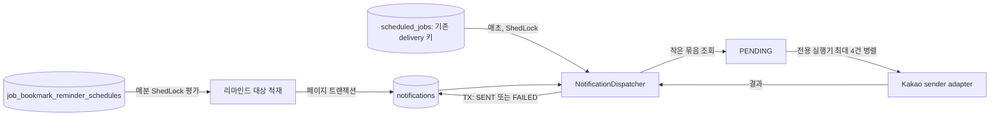

# 오공고 통합 알림 아키텍처와 기능 추가 가이드

- 상태: 구현 기준
- 대상 독자: 기존 알림 구조를 처음 읽거나 새 알림을 추가하는 백엔드 개발자
- 현재 provider 구현: NHN 카카오 알림톡
- 확장 채널: `EMAIL`, `FCM` enum과 adapter 경계만 마련. 실제 발송 어댑터는 아직 추가하지 않음
- 민감한 운영 설정값은 이 문서에 포함하지 않는다.

## 1. 핵심 개념

오공고의 사용자 알림은 발송 채널과 무관하게 `notifications` 테이블에 적재한다. 알림을 만드는 업무 흐름은 provider를 직접 부르지 않는다. 매초 실행되는 dispatcher가 due `PENDING` 행을 읽어 채널 sender로 보내고 결과를 기록한다.



한 행은 **수신자 한 명 × 채널 한 개 × 논리 알림 한 건**이다. 같은 수신자에게 카카오와 이메일을 모두 보내게 되면 채널마다 별도 행과 별도 deduplication key를 만든다.

알림 행을 저장한 시점은 중복 생성 방지 기준이지 provider 발송 완료가 아니다. 발송 상태는 `PENDING`, `SENT`, `FAILED` 세 가지다. `SENT`는 provider 접수를 뜻하며 사용자 단말 도착·열람을 보장하지 않는다.

## 2. 테이블과 상태

`notifications`는 도메인별 대기열을 대체하는 공통 저장소다. 현재 핵심 정보는 다음과 같다.

| 정보 | 의미 |
| --- | --- |
| `deduplication_key` | notification 행의 고유 키. 가입은 사용자별 고정 키, 리마인드는 적재 시 만든 UUID 키를 사용 |
| `channel` | `KAKAO`, `EMAIL`, `FCM` 등 sender 선택값 |
| `template_code` | provider 또는 애플리케이션 템플릿 식별자. 전 채널 필수 저장 |
| `recipient_user_id` | 내부 수신자 식별자. B2B/비회원 수신은 null 가능 |
| `recipient_address` | 전화번호, 이메일, 또는 추후 푸시 토큰. terminal 상태에서도 정리 전까지 보존 |
| `payload_json` | 해당 템플릿의 치환 변수. terminal 상태에서도 정리 전까지 보존 |
| `scheduled_at` | 이 시각 전에는 조회·발송하지 않음 |
| `sent_at` | provider 접수가 확인된 시각 |
| `provider_message_id` | provider 접수 응답에서 받은 추적 ID |
| `result_code` | provider 거절 또는 내부 실패 사유 코드 |

상태 흐름은 아래와 같다.



마감 변경으로 아직 `PENDING`인 리마인드가 무효화되면 해당 행을 삭제한다. `SENT`·`FAILED`는 상태와 결과 코드, 주소·payload를 30일 정리 전까지 보존한다. provider 응답 오류는 재시도하지 않고 `FAILED`로 기록한다.

## 3. 모듈 책임



| 책임 | 위치 | 원칙 |
| --- | --- | --- |
| 업무 이벤트, 대상 자격·예약 시각 계산 | API `business` / 기능별 `implement` | 공고·가입 정책은 알림 공통 도메인에 넣지 않음 |
| 알림 행 생성·중복 검사 | `ogonggo-core/notification/intake/implement/NotificationAppender` | API는 Repository를 직접 호출하지 않음 |
| 발송 대상 조회·결과 저장 | `ogonggo-core/notification/delivery/implement/NotificationManager` | provider HTTP 요청을 트랜잭션 안에서 하지 않음 |
| 만료 알림 정리 | `ogonggo-core/notification/delivery/implement/NotificationCleanupManager` | 최종 상태·보관 기간을 확인해 제한된 크기로 삭제 |
| 알림 상태·채널 모델과 Repository | `ogonggo-core/notification/domain`, `persistence` | intake와 delivery가 함께 사용하는 공통 모델·저장소 |
| 발송 실행·채널 sender 선택 | `ogonggo-api-user/notification/delivery` | 전체 실행은 ShedLock으로 직렬화하고 채널별 구현과 분리 |
| 채널별 provider 연동 | `ogonggo-api-user/notification/channel/<channel>` | Kakao/NHN 요청·응답 형식을 채널 Adapter 안에 둠 |

새 알림도 core Repository나 JPA Entity를 API에서 직접 조작하지 않는다. `notification/delivery`의 공통 실행 구조와 `notification/channel/alimtalk`의 채널 구현은 별도 패키지로 유지한다. provider 비밀값은 기존 외부 런타임 설정에서만 공급한다.

## 4. 알림 행 적재 방법

모든 사용자 알림은 `NotificationAppender`를 거친다.

- 단건 `append`와 페이지 `appendAll`은 호출자의 트랜잭션에 참여한다. 업무 변경과 알림 적재가 함께 커밋되거나 롤백되어야 할 때 사용한다.
- 가입 이벤트처럼 호출자의 커밋과 분리해야 하는 경로는 `appendInNewTransaction`을 사용한다. 가입 listener는 `AFTER_COMMIT` 후 전용 실행기에서 실행하며, 독립 트랜잭션에서 알림을 적재한다.
- 예약형 페이지는 `appendAll`과 페이지 커서 전진을 같은 트랜잭션에 둬 둘이 함께 커밋 또는 롤백되도록 한다.
- 동일한 `deduplication_key`가 이미 있으면 새 행을 만들지 않는다. DB 고유 제약이 마지막 방어선이다.
- 가입 키는 `sign_up_confirm:user:{userId}:KAKAO`라 가입 이벤트 재수신에도 중복 적재를 막는다.
- 리마인드 키는 적재 시 UUID를 생성해 저장하고 `clip-remind:job:{jobId}:` 접두어를 둔다. 마감 변경 시 이 공고 접두어를 가진 `PENDING` 행을 삭제한다. 페이지 알림 저장과 커서 이동이 한 트랜잭션이므로 페이지 실패·재처리에서 알림만 따로 남거나 중복 적재되지 않는다.
- 마감 변경 이벤트 자체의 재생 이력은 저장하지 않는다. 현재는 공고 마감 변경 트랜잭션에서 동기 이벤트로 일정 상태를 함께 갱신한다.
- 모든 상태 전이에서 `recipient_address`·`payload_json`을 유지한다. 로그에는 주소나 payload 원문을 남기지 않는다.

### 가입 안내 예시



가입 이벤트는 사용자 ID, 이름, 이메일, 전화번호, 로그인 제공자, 가입 시각을 스냅샷으로 담으므로 listener가 사용자 Repository를 다시 조회하지 않는다. listener는 공통 `NotificationAppender.appendInNewTransaction`을 호출한다. 이 경로가 중복 키 검사와 커밋 후 별도 트랜잭션을 함께 보장하므로 API 모듈에서 core Repository를 직접 호출하지 않는다.

listener는 `@Async` 대신 전용 적재 실행기에 작업을 명시적으로 제출한다. 큐 제출 거절과 작업 내부 저장 실패를 사용자 ID와 함께 기록하면서 가입 성공은 유지하기 위해서다. `@Async`도 named executor로 비동기화할 수 있지만, 예외·큐 포화 처리와 사용자 ID 로그 정책은 별도로 정해야 하므로 annotation만으로 이 동작이 단순히 해결되지는 않는다. Spring의 `void @Async` 작업 예외는 호출자에게 전달되지 않아 별도 예외 처리기가 필요하다.

provider 발송 전용 실행기와 적재 실행기를 분리해 NHN 지연이 가입 알림 적재를 막지 않는다. 따라서 커밋과 별도 적재 사이의 드문 유실 가능성은 허용한 정책이며, 반드시 보존해야 하는 이벤트라면 업무 트랜잭션 안에 outbox를 쓰는 별도 설계가 필요하다.

## 5. 예약형 알림과 통합 발송 worker

리마인드는 가입과 달리 미래 시각 대상자 평가가 필요하다. 일정 테이블은 공고·모집 종료 일시별 한 행으로 예정 시각·평가 상태·페이지 커서만 관리하고, 알림의 채널·템플릿·발송 결과는 `notifications`가 관리한다. 마감이 바뀌면 이전 일정을 취소하고, 기존 행이 있으면 새 일정 정보로 재사용한다. 별도 변경 이력 행은 두지 않는다.



현재 NHN `clip_remind` 템플릿 승인 전이라 `UserScheduledJobConfiguration`에서 리마인드 materializer의 `ScheduledJobDefinition` 등록을 임시 보류했다. 따라서 이 상태에서는 일정·후보가 있어도 reminder notification을 적재하지 않는다. 템플릿 승인 후 코드 등록을 복구하고, DB 작업 행이 비활성인지 확인한 뒤 운영자가 명시적으로 활성화한다.

- 리마인드 materializer를 활성화하면 매분 대상 페이지를 적재한다. ShedLock으로 다중 인스턴스의 일정 평가가 겹치는 것을 줄인다.
- 수신 대상은 페이지를 조회하는 시점의 자격으로 한 번 판단한다. bookmark ID 커서가 어떤 ID를 지나간 뒤에는 지원 상태 등 대상 자격이 바뀌어도 그 일정에서 이전 ID를 다시 조회하지 않는다. 따라서 페이지를 나눠 처리하는 동안 자격이 뒤늦게 생긴 대상은 이번 일정에서 제외한다.
- delivery dispatcher는 기존 DB 작업 키 `jobBookmarkAlimTalkDelivery`를 유지해 배포 시 기존 cron 설정을 보존한다. 기본 cron은 매초다.
- dispatcher 메서드 전체에 최대 90초 ShedLock을 적용한다. 인스턴스별 행 claim 상태 없이 한 실행만 due 목록을 읽고 처리한다. 처리 예산 45초와 provider 연결·응답 timeout을 감안하고, 비정상 종료 후 잠금이 오래 남는 것을 피한다.
- provider 호출은 로컬 전용 `notificationDeliveryTaskExecutor`의 고정 4개 스레드에서 최대 4건씩 병렬 처리한다. 큐는 두지 않고 한 실행은 최대 45초 처리한다. 가입 알림 적재에는 별도 `notificationEnqueueTaskExecutor`를 쓴다.
- 대상 조회와 결과 기록만 짧은 DB 트랜잭션으로 처리한다. 실제 provider HTTP 요청은 트랜잭션 밖에서 실행한다.
- provider 오류 응답은 재시도하지 않고 `FAILED`로 기록한다. 결과 저장에 실패한 실행은 더 처리하지 않고 끝내며 해당 행은 `PENDING`으로 남아 다음 실행에서 다시 읽힐 수 있다. 이는 별도 retry 정책이 아니라 대기 상태 행의 기본 처리이며, NHN 접수 후 저장이 실패한 경우 중복 발송 가능성을 포함한다. 동일 NHN 멱등성 키는 10분 이내 중복 요청을 억제하지만 그 이후 재호출은 중복될 수 있다.

## 6. 상태·provider 규칙

- 현재 `KAKAO`는 `NHN AlimTalk` sender를 사용한다. NHN 등록 `template_code`와 변수만 전달하고 본문·버튼을 애플리케이션에서 복제하지 않는다.
- 기존 설정 키 `nhn.appKey`, `nhn.secretKey`, `nhn.sendKey`, `nhn.templateCode` 이름은 유지한다. 실제 설정값은 소스·문서·로그에 두지 않는다.
- 같은 논리 알림은 항상 같은 NHN 멱등성 키를 사용해 짧은 시간 내 우발적 중복 요청을 억제한다. 이 키는 자동 재시도 정책이 아니다.
- provider가 접수한 응답만 `SENT`로 기록한다. `-1005` 중복 키 응답은 접수 확인이 아니므로 `FAILED`와 `result_code=-1005`로 기록한다.
- NHN 거절, 통신 오류, HTTP 응답 오류, 해석 불가 응답, 미분류 sender 예외를 모두 최종 `FAILED`로 기록한다. 자동 retry 횟수·백오프·cutoff 정책은 두지 않는다.
- enum에 `EMAIL`, `FCM` 값과 `NotificationSender` 확장 지점은 있다. 실제 sender가 없는 채널은 `CHANNEL_NOT_CONFIGURED`로 실패 처리한다. 새 채널을 쓸 때 provider client·설정·템플릿 렌더링·오류 분류를 별도로 구현하고 테스트한다.
- provider의 성공 응답과 사용자 도달은 구분한다. 도달 확인 webhook이 없는 채널은 도달 여부를 이 테이블만으로 주장하지 않는다.

### 채널별 발송 확장

- `NotificationDispatcher`가 `NotificationSender` 목록을 채널별로 선택한다. dispatcher는 특정 provider 요청 형식을 알지 않는다.
- 자동 재시도 기능은 구현하지 않는다. 실제 실패 증가나 운영 요구가 확인된 뒤 필요성을 다시 판단한다.
- NHN의 10분 멱등성은 현재 Kakao sender가 쓰는 provider 보장으로만 사용한다. NHN API가 중복 키를 반환하면 접수 여부가 확정되지 않으므로 `FAILED`로 추적한다.
- sender가 설정되지 않은 채널은 즉시 `FAILED`로 기록하고 사유 코드 `CHANNEL_NOT_CONFIGURED`를 남긴다.
- 공통 발송 시간대 제한은 두지 않는다. 예정 시각이 도래하면 시간대와 무관하게 처리할 수 있다.

### 보관과 실제 도달 결과

- `SENT`는 provider 접수를 뜻한다. NHN에서 Kakao로 전달된 뒤의 실패율과 사용자 단말 도착은 현재 추적하지 않는다. provider 조회나 webhook을 연결하기 전에는 최종 도달 지표로 사용하지 않는다.
- `SENT`, `FAILED` 행은 terminal 상태가 된 뒤 30일 후 정리한다. terminal 상태에서도 주소·payload를 보존한다. `PENDING`은 발송 결과가 아직 없어 나이와 무관하게 정리 대상에서 제외한다.
- 30일 후 행을 삭제하면 deduplication key도 사라진다. 같은 업무 이벤트가 다시 적재될 경우 중복 행이 생길 수 있으며, 이 가능성은 허용한다. 마감 변경으로 제거한 미발송 행도 key와 함께 사라진다.
- `notificationCleanup`이 매일 03:30(Asia/Seoul)에 실행된다. `updated_at`이 30일 전 또는 그 이전인 `SENT`·`FAILED` 행을 500건씩 별도 트랜잭션으로 삭제하며, 한 실행은 최대 45초 동안 다음 배치를 반복한다. `PENDING`은 삭제하지 않는다.

### 로그로 보는 최소 운영 신호

- 가입 적재는 `APPENDED`, `DUPLICATE`, 생략 사유, 실행기 포화·저장 오류를 로그에 남긴다. 가입 결과와 연락처·이메일은 기록하지 않는다.
- 리마인드 scheduler 실행마다 INFO 요약 로그로 run ID, 소요 시간, 처리 페이지 수, 평가 후보 수, 적재 수, 잘못된 전화번호 수, 45초 실행 한도 도달 여부를 남긴다. 페이지마다 별도 로그를 남기지 않아 로그량을 제한한다. 실행 한도에 반복 도달하면 주기와 페이지 크기를 검토한다. 잠금 미취득 시에는 scheduler 이름을 기록한다.
- dispatcher 요약 로그는 provider 접수 `SENT`, 최종 `FAILED`, 결과 미확정 건수를 집계한다. `-1005`는 접수 확인이 아니므로 성공 건수에 합치지 않는다.
- provider 거절·최종 실패는 채널과 provider `resultCode`로 집계할 수 있다. 전체 요청·응답, 번호, payload는 남기지 않는다.
- 별도 알림·대시보드는 추가하지 않는다. notification 대기 잔량/노후도와 정리 비용은 정리 작업·계측이 구현될 때까지 로그 집계 범위 밖이다.

## 7. 현재 리마인드 정책과 데이터 이관

스크랩 리마인드 대상 정책은 일반 알림 규칙이 아니라 `clip_remind` 기능 규칙이다.

- 공개·모집 중인 채용공고에 대해 모집 마감 정확히 24시간 전을 예정 시각으로 사용한다.
- 예정 시각 평가 당시 활성 일반회원의 활성 스크랩 중 `SCRAPPED`, `PREPARING` 상태만 적재한다.
- D-1 예정 시각을 지난 신규 스크랩은 건너뛰고, 기존 스크랩은 스케줄 실행 지연을 허용한다.
- 마감일 변경 후 새 D-1 시각이 미래면 변경된 일정은 별도 알림이며, 새 시각이 이미 지났으면 소급 생성하지 않는다.
- 마감 변경 시 해당 공고의 `PENDING` notification 행을 삭제한다. dispatcher가 이미 행을 읽어 provider 호출을 시작했다면 취소를 보장하지 않는다. 이 경합에서는 이전 알림과 새 마감 기준 알림이 모두 발송될 수 있다.
- 일정은 공고·마감일마다 한 행만 둔다. 되돌아온 마감은 해당 행을 재사용한다. 각 새 notification은 새 UUID 고유 키를 받고 `clip-remind:job:{jobId}:` 접두어로 해당 공고의 미발송 행을 찾아 취소한다.
- `template_code=clip_remind`, 치환 변수 `name`, `posting-title`을 저장한다. 업체명·직무명은 NHN 정적 템플릿에 있으므로 애플리케이션에서 만들지 않는다.
- 최초 배포용 `docs/schema/2026-10-06-notifications.sql`은 `job_bookmarks.active_since`, 공고별 일정 테이블, 공통 `notifications`를 생성하고 기존 공고의 미래 D-1 일정만 seed한다. 적재·발송 스케줄 행은 비활성, 보관 정리 행은 활성 상태로 미리 만든다. 이 브랜치의 이전 전용 `job_bookmark_reminders` 큐는 배포된 적이 없으므로 해당 테이블을 만들거나 데이터를 이관하지 않는다.
- SQL은 `jobBookmarkAlimTalkReminder` 행을 비활성으로 미리 만든다. 현재 코드는 reminder job을 등록하지 않으며, 템플릿 승인 후 코드 등록을 복구하고 `scheduled_jobs.enabled`를 별도로 활성화한다. `jobBookmarkAlimTalkDelivery`의 기존 설정도 코드 배포가 덮어쓰지 않으므로 운영 적용 전 주기·enabled를 확인한다.

## 8. 새 알림 추가 절차

새 알림은 먼저 **발생 방식과 유실 허용 여부**를 정하고, 그 다음 템플릿·수신자·중복 키를 결정한다. 기존 카카오 알림톡에 템플릿만 추가하는 일과 실제 발송 채널을 추가하는 일을 구분한다.

```mermaid
flowchart TD
    A[새 알림 요구사항] --> B{발생 방식}
    B -->|업무 이벤트| C{적재 유실 허용?}
    C -->|허용| D[커밋 후 listener + 전용 적재 실행기]
    C -->|불허| E[구현 중단 후 durable 적재 방식 합의]
    B -->|시각·대상 집합| F[업무 소유 API의 scheduler]
    F --> G[대상 계산 + 필요 시 페이지 트랜잭션]
    D --> H[NotificationAppender]
    G --> H
    H --> I[(notifications)]
    I --> J[공통 delivery worker]
    J --> K[등록된 채널 sender]
```



현재 가입 알림은 커밋 후 메모리 실행기에 적재를 맡기므로 프로세스 종료·큐 포화 때 유실될 수 있다. 유실을 허용할 수 없는 요구사항에 이 방식을 그대로 복사하지 않는다. 현재 notification 적재 경로에는 업무 트랜잭션과 원자적인 outbox가 연결되어 있지 않으므로, durable 처리가 필요하면 그 설계를 먼저 합의한다.

### 8.1 요구사항과 식별 규칙

구현 전에 기능 문서나 PR 설명에 아래 정책을 남긴다.

- 발생 조건과 수신 대상, 수신자 정보를 확정하는 시점
- 이벤트형인지 예약형인지, 예정 시각 계산과 허용 지연
- 적재 유실·발송 실패를 업무 성공과 분리할 수 있는지
- 취소 조건. 마감 변경은 공고의 아직 대기 중인 `PENDING` 알림 행을 삭제한다. 이미 provider 요청이 시작된 알림은 취소를 보장하지 않는다.
- 같은 이벤트의 재수신과 별개의 새 알림을 각각 중복으로 볼지 여부
- `templateCode`, payload 키·값 형식, 수신 주소, 개인정보 보존 범위

`deduplication_key`는 테이블 전체에서 고유해야 한다. 따라서 단순히 알림 종류·업무 대상·수신자·채널만 조합하면, 같은 대상에게 별도 시점에 보내야 하는 새 알림까지 막을 수 있다.

- 같은 논리 이벤트가 재전달될 때 한 건만 적재해야 하면 그 이벤트를 식별하는 안정적인 키를 사용한다. 가입 안내는 `sign_up_confirm:user:{userId}:KAKAO`를 사용한다.
- 마감 변경처럼 별개의 발송 건으로 취급해야 하면 새 알림마다 새 UUID 키를 만든다. 현재 리마인드는 `clip-remind:job:{jobId}:{uuid}:user:{userId}:KAKAO` 형식이다.
- 리마인드 페이지 적재는 알림 행 저장과 페이지 커서 갱신을 같은 트랜잭션에서 처리한다. 키만 새로 만들고 트랜잭션 경계를 분리하면 페이지 재처리 때 중복 방지가 깨질 수 있다.

### 8.2 구현 위치와 처리 방식

- 가입·스크랩 등 사용자 업무 조건은 해당 업무를 소유한 API의 Business/Implement에 둔다. 관리 API가 알림을 만들 때도 해당 API에서 업무 조건을 판단한다.
- 알림 행 생성은 `NotificationAppendDto`와 core의 `NotificationAppender`를 사용한다. API에서 core Repository나 JPA Entity를 직접 다루지 않는다.
- 새 클래스를 어디에 둘지 아래 패키지 지도를 기준으로 결정한다. 알림톡 provider 공통 코드와 개별 알림의 업무 흐름을 같은 패키지에 섞지 않는다.

```text
com.ogonggo.userapi.notification
├── intake/                                     # 알림 생성·검증·notifications 적재
│   ├── business/
│   │   ├── ReminderEnqueueTemplate.kt           # 예약형 페이지 적재 공통 흐름
│   │   └── JobBookmarkReminderEnqueueService.kt # 북마크 대상·payload·커서 정의
│   └── implement/
│       ├── reminder/
│       │   └── JobBookmarkReminderScheduler.kt   # 리마인드 적재 주기 작업
│       └── signup/
│           ├── UserSignUpAlimTalkEventListener.kt # 가입 커밋 후 적재
│           └── UserSignUpAlimTalkPreparer.kt      # 가입 입력·변수 구성
├── delivery/                                   # 채널 독립적인 발송 실행·보관 정리
│   └── implement/
│       ├── NotificationDispatcher.kt            # 공통 발송 실행과 ShedLock
│       └── NotificationSender.kt                # 채널 sender 계약
│       └── NotificationCleanupScheduler.kt      # 보관 기간이 지난 알림 정리
└── channel/
    └── alimtalk/                                # Kakao/NHN 채널 Adapter 구현
        ├── AlimTalkMessage.kt                    # NHN 요청에 전달할 메시지 값
        ├── AlimTalkRecipientNumberPolicy.kt      # 알림톡 수신 번호 정규화
        ├── ReminderAlimTalkTemplate.kt            # provider 등록 템플릿 코드
        ├── KakaoNotificationSender.kt            # 저장된 KAKAO 알림의 NHN 발송
        ├── NhnAlimTalkClient.kt                  # NHN HTTP 요청·응답 변환
        ├── NhnAlimTalkProperties.kt              # NHN 설정 바인딩 타입
        └── NhnAlimTalkResult.kt                  # NHN 결과·통신 오류 타입
```

- `intake`와 `delivery`는 채널 독립적인 알림 구조이고 `channel/alimtalk`는 NHN/Kakao 연동 구현이다. dispatcher는 NHN 요청 DTO나 알림톡 결과 타입을 알지 않는다.
- NHN 요청 DTO·HTTP client·응답 변환은 `channel/alimtalk`에 둔다. 가입·리마인드 intake는 NHN 요청 DTO에 의존하지 않고 수신 주소·template code·payload를 notification 저장 계약으로 전달한다.
- `intake/business`에는 대상 조회·알림 적재·커서 이동의 사용자 업무 흐름을 둔다. `intake/implement/signup`과 `intake/implement/reminder`에는 각 알림 유스케이스의 listener·preparer와 대상 적재 scheduler를 둔다. provider 등록 템플릿 코드와 발송 구현은 별도 `channel/<channel>` 아래에 둔다.
- `ReminderAlimTalkTemplate`에는 provider에 등록된 템플릿 코드만 두고 `channel/alimtalk`에 배치한다. 예약 시각은 해당 일정을 생성하는 업무 흐름이 한 곳에서 계산한다. 현재 `clip_remind`는 공고 마감 24시간 전에 처리 대상이 된다. 가입의 `sign_up_confirm` 코드는 가입 전용 `UserSignUpAlimTalkPreparer`에 둔다. 가입 알림도 `scheduled_at=joinedAt`으로 notification에 적재된 뒤 공통 dispatcher가 발송한다.
- core `notification`에서는 `domain`·`persistence`를 intake와 delivery가 공유한다. `intake/implement`는 알림 행 적재를, `delivery/implement`는 due 조회·결과 반영·보관 정리를 맡는다. Appender DTO와 delivery DTO는 각 구현 패키지 아래 `dto`에 둔다.
- 새 이벤트 알림의 업무 흐름은 `intake/business`, 이벤트 수신과 값 변환은 `intake/implement`에 둔다. 새 리마인드도 대상 적재 Service와 scheduler는 `intake` 아래에 둔다. 채널별 provider 구현은 `channel/<channel>`로 분리한다.
- `ReminderEnqueueTemplate`은 조회·알림 payload·커서 형식을 알지 않는다. 구현체가 `Work`, `Candidate`, `Cursor`, 조회·변환·커서 이동 hook과 `workBatchSize`·`candidatePageSize`를 정의한다. 적재와 커서 이동은 같은 페이지 트랜잭션으로 묶는다.
- 실행 주기(cron)는 공통 템플릿이나 배치 계약이 아니라 `UserScheduledJobConfiguration`과 DB의 `scheduled_jobs`에서 정한다. 새 scheduler는 설정 클래스에 `ScheduledJobDefinition`으로 등록하며 YAML에 별도 cron을 추가하지 않는다.
- Spring 실행기·RestClient·스케줄러 등록처럼 애플리케이션 설정은 기존 `config` 패키지에 둔다. `NhnAlimTalkProperties`처럼 채널 설정을 바인딩하는 클래스는 `channel/alimtalk` 소유다.
- 이벤트형은 유실 허용 정책일 때 커밋 후 listener에서 전용 적재 실행기를 사용한다. listener와 업무 요청 안에서 NHN이나 다른 provider를 직접 호출하지 않는다.
- 예약형은 대상 계산을 소유한 API가 스케줄 작업으로 처리한다. 스케줄은 대상을 `notifications`에 적재하고 provider 발송을 직접 수행하지 않는다. 페이지 커서·평가 상태를 재시작 뒤에도 유지해야 할 때만 기능별 일정 저장 모델을 추가한다.
- 현재 스크랩 마감 리마인드는 일정 ID를 작업 단위로 10개까지 조회하고, 일정당 후보를 500개까지 읽으며 `Long` bookmark ID를 cursor로 사용한다.

core의 공통 저장 모델은 intake와 delivery에서 사용하므로 두 흐름 하위로 옮기지 않는다. 구현만 해당 흐름에 둔다.

```text
com.ogonggo.core.notification
├── domain/                                # 모든 알림 흐름이 공유하는 상태·채널
├── persistence/                           # 공통 JPA Repository
├── intake/
│   ├── domain/NotificationTiming.kt       # 공통 적재 예정 시각 계산
│   └── implement/
│       ├── NotificationAppender.kt
│       └── dto/NotificationAppendDto.kt
└── delivery/
    └── implement/
        ├── NotificationManager.kt         # due 조회·발송 결과·대기 알림 삭제
        ├── NotificationCleanupManager.kt  # 최종 상태 알림 보관 정리
        └── dto/
            ├── NotificationMessageDto.kt
            ├── NotificationDeliveryResult.kt
```
- 예약 작업은 DB의 `scheduled_jobs`와 `ScheduledJobDefinition` 규칙을 따른다. 새 YAML cron을 임의로 추가하지 않고 [스케줄 작업 가이드](scheduling.md)를 확인한다.
- 알림 한 건에 수신자 한 명·채널 한 개를 저장한다. 채널별로 보내야 하면 각각 별도의 알림 행과 키를 만든다.
- `scheduledAt` 계산에는 주입된 `Clock`과 프로젝트 시간대 규칙을 따른다. 템플릿 변수는 등록된 템플릿이 요구하는 키와 일치시킨다.
- 로그에는 알림 ID, 실행 ID, 채널, 결과 코드, 건수 등 추적에 필요한 최소 정보만 남긴다. 수신 주소와 payload 원문·비밀 설정값은 남기지 않는다.

### 8.3 템플릿과 채널 확장

- 현재 카카오 sender는 NHN에 등록된 `templateCode`와 변수만 전달한다. 정적 본문·버튼을 애플리케이션에서 다시 만들지 않는다.
- 현재 실제 발송이 구현된 채널은 `KAKAO`뿐이다. `EMAIL`, `FCM`은 enum과 sender 확장 지점만 있으며 실제 발송기·토큰 등록·provider 설정은 없다.
- 기존 채널에 새 알림 템플릿만 추가한다면 새 sender나 채널 enum을 만들지 않는다. 새 provider 채널을 추가한다면 sender 구현만으로 완료되지 않는다. provider 설정과 비밀값 주입, 응답·오류 변환, 멱등성, 상태 추적, 테스트를 함께 준비한다.
- 현재는 자동 재시도 정책이 없다. 새 provider를 추가해도 retry 정책은 실제 필요가 확인된 뒤 채널별로 설계한다.
- `SENT`는 provider가 요청을 접수했다는 뜻이다. provider 후속 전달 결과나 사용자 단말 도착을 조회·수신하지 않는 한 최종 수신 성공으로 기록하거나 설명하지 않는다.

### 8.4 트랜잭션·상태·보관

- 단건 `append`와 배치 `appendAll`은 호출자의 트랜잭션에 참여한다. 커밋 후 분리 적재에는 `appendInNewTransaction`을 사용한다.
- 발송 결과 전이는 `NotificationManager`와 도메인 모델을 통해 `PENDING`에서 `SENT` 또는 `FAILED`로 기록한다. 직접 SQL/JPA 상태 수정을 추가하거나 provider HTTP 호출 중 DB 트랜잭션·row lock을 유지하지 않는다.
- 업무 요구에 취소가 없다면 별도 취소 상태나 취소 배치를 추가하지 않는다. 취소가 필요하면 취소 대상 상태와 이미 처리 중인 요청의 한계를 명시한다.
- `SENT`·`FAILED`는 terminal 상태이며 마지막 상태 변경 후 30일이 지나면 정리 작업으로 삭제한다. 마감 변경 때 삭제된 `PENDING` 행에는 발송 이력을 남기지 않는다. 로그에는 주소나 payload를 남기지 않는다.
- notification schema 변경은 버전 관리되는 SQL에 반영하고, 새 테이블·인덱스·`scheduled_jobs` 초기값·기존 데이터 처리·롤백 영향을 검토한다. 운영 적용 여부를 확인하지 않은 migration을 이미 배포된 것으로 간주하지 않는다.

### 8.5 테스트 및 리뷰 완료 기준

- 대상 선정·예정 시각·payload 구성·중복 키 규칙은 가능한 가장 낮은 테스트 계층에서 검증한다.
- 실제 DB 제약, 쿼리 필터, 페이지 적재와 커서의 원자성이 중요한 경우 영속성 테스트를 추가한다.
- 이벤트 커밋 경계·실행기와 알림 저장 연결처럼 계층 간 계약만 통합 테스트로 검증한다.
- provider adapter를 추가할 때는 성공·거절·불명확 응답·통신 오류와 요청 필드를 가짜 HTTP 응답으로 검증한다. 사용자의 실제 연락처나 비밀값은 fixture와 로그에 넣지 않는다.
- ShedLock 다중 인스턴스 직렬화, `PENDING → SENT/FAILED`, 중복 적재 방지, 마감 변경 시 pending 행 삭제를 검증한다. 자동 재시도·claim 복구는 구현하지 않는다.
- 테스트는 한국어 `@DisplayName`, 백틱 함수명, `// given`, `// when`, `// then`을 사용한다. 구현 상세 호출 횟수보다 외부에서 관찰 가능한 결과·상태·DB 불변식을 검증한다. 기준은 [테스트 작성 가이드](testing.md)다.
- 변경에 필요한 SQL과 운영 활성화 순서를 확인하고, `git diff --check` 및 영향 모듈의 관련 Gradle 테스트를 실행한다.

## 9. 구현 코드와 참고 문서

- [Notification.kt](../../ogonggo-core/src/main/kotlin/com/ogonggo/core/notification/domain/Notification.kt)
- [NotificationTiming.kt](../../ogonggo-core/src/main/kotlin/com/ogonggo/core/notification/intake/domain/NotificationTiming.kt)
- [NotificationAppender.kt](../../ogonggo-core/src/main/kotlin/com/ogonggo/core/notification/intake/implement/NotificationAppender.kt)
- [NotificationAppendDto.kt](../../ogonggo-core/src/main/kotlin/com/ogonggo/core/notification/intake/implement/dto/NotificationAppendDto.kt)
- [NotificationManager.kt](../../ogonggo-core/src/main/kotlin/com/ogonggo/core/notification/delivery/implement/NotificationManager.kt)
- [NotificationCleanupManager.kt](../../ogonggo-core/src/main/kotlin/com/ogonggo/core/notification/delivery/implement/NotificationCleanupManager.kt)
- [NotificationMessageDto.kt](../../ogonggo-core/src/main/kotlin/com/ogonggo/core/notification/delivery/implement/dto/NotificationMessageDto.kt)
- [NotificationDeliveryResult.kt](../../ogonggo-core/src/main/kotlin/com/ogonggo/core/notification/delivery/implement/dto/NotificationDeliveryResult.kt)
- [NotificationDispatcher.kt](../../ogonggo-api-user/src/main/kotlin/com/ogonggo/userapi/notification/delivery/implement/NotificationDispatcher.kt)
- [NotificationCleanupScheduler.kt](../../ogonggo-api-user/src/main/kotlin/com/ogonggo/userapi/notification/delivery/implement/NotificationCleanupScheduler.kt)
- [NotificationSender.kt](../../ogonggo-api-user/src/main/kotlin/com/ogonggo/userapi/notification/delivery/implement/NotificationSender.kt)
- [KakaoNotificationSender.kt](../../ogonggo-api-user/src/main/kotlin/com/ogonggo/userapi/notification/channel/alimtalk/KakaoNotificationSender.kt)
- [NhnAlimTalkClient.kt](../../ogonggo-api-user/src/main/kotlin/com/ogonggo/userapi/notification/channel/alimtalk/NhnAlimTalkClient.kt)
- [ReminderAlimTalkTemplate.kt](../../ogonggo-api-user/src/main/kotlin/com/ogonggo/userapi/notification/channel/alimtalk/ReminderAlimTalkTemplate.kt)
- [JobBookmarkReminderScheduler.kt](../../ogonggo-api-user/src/main/kotlin/com/ogonggo/userapi/notification/intake/implement/reminder/JobBookmarkReminderScheduler.kt)
- [UserSignUpAlimTalkEventListener.kt](../../ogonggo-api-user/src/main/kotlin/com/ogonggo/userapi/notification/intake/implement/signup/UserSignUpAlimTalkEventListener.kt)
- [JobBookmarkReminderEnqueueService.kt](../../ogonggo-api-user/src/main/kotlin/com/ogonggo/userapi/notification/intake/business/JobBookmarkReminderEnqueueService.kt)
- [ReminderEnqueueTemplate.kt](../../ogonggo-api-user/src/main/kotlin/com/ogonggo/userapi/notification/intake/business/ReminderEnqueueTemplate.kt)
- [스케줄 작업](scheduling.md), [시간 처리](time-handling.md), [테스트 작성 방식](testing.md)
