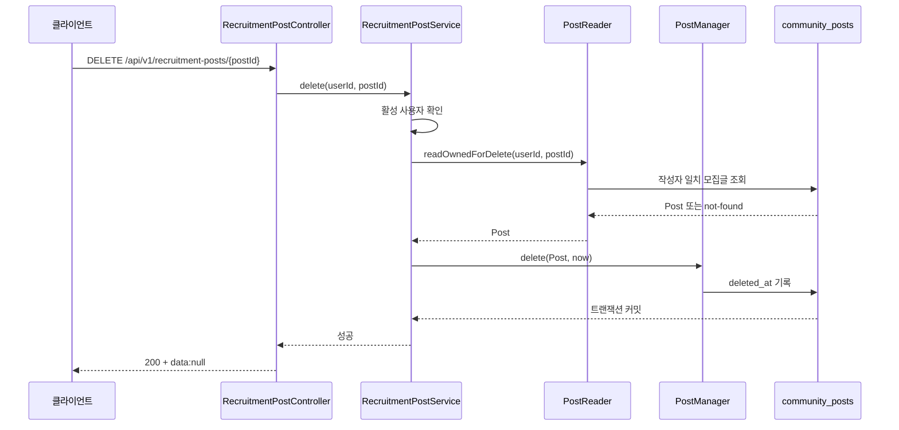

# 사이드·스터디 모집글 삭제 API 설계

- 상태: Implemented
- 작성일: 2026-09-11
- 적용 범위: `ogonggo-api-user`의 모집글 작성자 삭제
- 기준 리소스: `Post` (`community_posts`)
- 선행 문서: `recruitment-post-create-reverse-plan.md`, `recruitment-post-list-read-api.md`, `recruitment-post-detail-read-api.md`

이 문서는 사이드 프로젝트·스터디 모집글을 작성자가 삭제하기 위한 API 계약과 구현 기준을 정리한다. 기존 채용공고 삭제 구현과 오공고 공통 소프트 삭제 정책을 기준으로 작성했으며, 현재 계약을 User API와 Core에 반영했다.

## 1. 범위와 결정

### 1.1 이번 API의 대상

- 로그인한 모집글 작성자가 자신의 모집글을 삭제한다.
- 사이드 프로젝트와 스터디는 같은 `Post` 리소스이므로 `recruitmentType`을 URL에 포함하지 않는다.
- 삭제는 물리 삭제가 아닌 소프트 삭제로 처리한다.
- 삭제된 모집글은 일반 목록·상세 조회에서 제외한다.
- 삭제 후 복구 API는 제공하지 않는다.

### 1.2 이번 API에서 제외하는 기능

- 관리자의 운영자 삭제·복구
- 모집글 비공개 전환
- 모집글 수정
- 모집 마감
- 댓글·북마크·지원자 데이터의 별도 삭제 정책

관리자 화면에 정의된 `/api/v1/admin/side-studies/{postId}`는 사용자 작성자 삭제와 다른 계약이다. 관리자 삭제가 필요하면 `ogonggo-api-admin`의 별도 도메인·권한 정책으로 설계한다.

## 2. API 계약

### 2.1 요청

```http
DELETE /api/v1/recruitment-posts/{postId}
Authorization: Bearer {ogonggo-access-token}
```

| 항목 | 규칙 |
| --- | --- |
| 인증 | 필수 |
| `postId` | 양의 정수, `1` 이상 |
| Request Body | 없음 |
| 쿼리 파라미터 | 없음 |

`GET /api/v1/recruitment-posts/**`만 비로그인 조회로 열려 있고, 그 외 모집글 경로는 인증이 필요하다. 삭제 API를 추가할 때 별도의 Security 허용 설정은 필요하지 않다.

### 2.2 성공 응답

삭제할 데이터를 반환하지 않으므로 공통 성공 응답의 `200 OK`와 `data: null`을 사용한다.

```http
HTTP/1.1 200 OK
Content-Type: application/json
```

```json
{
  "status": 200,
  "message": "요청이 성공했습니다.",
  "data": null
}
```

같은 작성자가 이미 삭제한 글에 다시 삭제를 요청해도 동일한 응답을 반환한다. 삭제 명령은 멱등하게 처리한다.

### 2.3 실패 응답

모든 오류는 `{ status, code, message }` 형식을 사용한다.

| 상황 | HTTP | code | 설명 |
| --- | ---: | --- | --- |
| 인증 정보 없음·유효하지 않음 | 401 | `UNAUTHORIZED` | Security Handler가 응답 |
| 정지된 사용자 | 403 | `USER_SUSPENDED` | 활성 사용자만 삭제 가능 |
| 탈퇴한 사용자 | 403 | `USER_WITHDRAWN` | 활성 사용자만 삭제 가능 |
| `postId < 1` | 400 | `BAD_REQUEST` | Bean Validation 실패 |
| 글이 없거나 본인 글이 아님 | 404 | `RECRUITMENT_POST_NOT_FOUND` | 리소스 존재 여부와 소유권을 함께 숨김 |
| 서버 내부 오류 | 500 | `INTERNAL_SERVER_ERROR` | 공통 예외 처리 기준 적용 |

본인 글이라면 이미 `deletedAt`이 기록된 상태도 삭제 성공으로 간주한다. 반대로 삭제된 글이라도 다른 사용자가 요청하면 404로 응답한다.

## 3. 삭제 상태 정책

`publicationStatus`와 삭제 여부를 하나의 enum으로 합치지 않는다. 공개·비공개는 노출 정책이고, 삭제는 리소스 생명주기이므로 별도 상태로 관리한다.

```text
삭제 가능
  deletedAt = null
      │
      │ DELETE /api/v1/recruitment-posts/{postId}
      ▼
삭제 완료
  deletedAt = 삭제 시각
```

### 3.1 저장 변경

`Post`에 다음 컬럼을 추가한다.

```kotlin
@Column(name = "deleted_at")
var deletedAt: LocalDateTime? = null
    protected set
```

도메인 행위는 최초 삭제 시각을 보존한다.

```kotlin
fun delete(deletedAt: LocalDateTime) {
    if (this.deletedAt == null) {
        this.deletedAt = deletedAt
    }
}
```

다음 정책은 적용하지 않는다.

- `publicationStatus = HIDDEN`으로 변경해 삭제를 표현하지 않는다.
- `JpaRepository.delete*`로 행을 제거하지 않는다.
- 이미 삭제된 글의 `deletedAt`을 다시 덮어쓰지 않는다.

### 3.2 조회 영향

기존 공개 조회 조건은 다음처럼 확장해야 한다.

```text
publicationStatus = PUBLISHED
AND deletedAt IS NULL
```

적용 대상:

- `PostReader.readPublished(postId)`
- `PostReader.readPublishedPage(...)`
- 이후 추가되는 공개 모집글 조회·정렬·검색 기능

삭제된 글의 존재 확인이 필요한 관리 기능은 `readIncludingDeleted`처럼 목적이 드러나는 별도 계약으로 추가한다. 일반 공개 조회에 삭제 데이터를 섞지 않는다.

## 4. 처리 흐름



### 4.1 계층별 책임

| 계층 | 책임 |
| --- | --- |
| Presentation API | `DELETE` 매핑, `postId` 양수 검증, 인증 사용자 식별자 수신 |
| `RecruitmentPostService` | 활성 사용자 확인, 작성자 소유 조회와 삭제의 트랜잭션 경계 조합 |
| `PostReader` | 작성자와 글 식별자가 일치하는 삭제 대상 조회, not-found 변환 |
| `PostManager` | `Post.delete(now)` 호출과 변경 저장 |
| `Post` | 최초 삭제 시각 보존과 삭제 불변식 관리 |
| Repository | 작성자 조건·잠금·삭제 상태를 반영한 영속성 조회 |

API Service는 Repository를 직접 호출하지 않는다. `PostManager`는 기존 모집글 공통 구현으로 두고, 사용자별 권한 판단은 `RecruitmentPostService`가 소유한다.

### 4.2 트랜잭션과 현재 시각

- `RecruitmentPostService.delete`에 `@Transactional`을 둔다.
- 삭제 대상 조회부터 `deletedAt` 저장까지 하나의 트랜잭션으로 처리한다.
- `Clock`을 주입받고 `LocalDateTime.now(clock)`을 한 번만 생성한다.
- 도메인에는 `Clock`을 전달하지 않고 계산된 `LocalDateTime`을 전달한다.
- 동시 삭제 요청은 작성자 조건과 잠금 또는 조건부 갱신으로 직렬화해 최초 삭제 시각을 보존한다.

## 5. 소유권과 멱등성

삭제용 조회는 일반 수정·공개 조회와 분리한다.

```text
readOwnedForDelete(userId, postId)
  → authorUserId = userId인 글만 대상
  → 이미 삭제된 본인 글도 조회
  → 글이 없거나 작성자가 다르면 RECRUITMENT_POST_NOT_FOUND
```

기존 내 채용공고 삭제 구현처럼 삭제용 조회는 이미 삭제된 행도 확인하고, 도메인의 `delete`는 `deletedAt == null`일 때만 값을 기록한다. 이를 통해 다음 결과를 보장한다.

- 첫 번째 삭제: `deletedAt` 기록 후 200
- 같은 사용자의 반복 삭제: 값 변경 없이 200
- 존재하지 않는 글: 404
- 다른 사용자의 글: 404
- 삭제된 글을 다른 사용자가 요청: 404

## 6. OpenAPI 명세

`RecruitmentPostApi`에 다음 삭제 operation을 반영했다.

```kotlin
@Operation(
    operationId = "deleteMyRecruitmentPost",
    summary = "내 사이드 프로젝트·스터디 모집글 삭제",
    description = "작성자 본인의 모집글을 소프트 삭제합니다. 이미 삭제된 글을 다시 삭제해도 성공합니다.",
)
@SecurityRequirement(name = USER_BEARER_AUTH_SCHEME)
@ApiResponses(
    value = [
        ApiResponse(responseCode = "200", description = "삭제 성공", useReturnTypeSchema = true),
        ApiResponse(
            responseCode = "400",
            description = "postId가 1 미만",
            content = [Content(schema = Schema(implementation = ErrorResponse::class))],
        ),
        ApiResponse(
            responseCode = "401",
            description = "인증되지 않은 요청",
            content = [Content(schema = Schema(implementation = ErrorResponse::class))],
        ),
        ApiResponse(
            responseCode = "403",
            description = "USER_SUSPENDED 또는 USER_WITHDRAWN",
            content = [Content(schema = Schema(implementation = ErrorResponse::class))],
        ),
        ApiResponse(
            responseCode = "404",
            description = "RECRUITMENT_POST_NOT_FOUND: 모집글이 없거나 본인 글이 아님",
            content = [Content(schema = Schema(implementation = ErrorResponse::class))],
        ),
    ],
)
fun deleteRecruitmentPost(
    @Parameter(hidden = true) userId: Long,
    @PathVariable("postId") @Positive postId: Long,
): ResponseEntity<SuccessResponse<Unit>>
```

클라이언트에 `userId`, `deletedAt`, 삭제 사유를 반환하지 않는다. 삭제 시각은 서버 내부 상태이며 삭제 사유 입력은 이번 요구사항에 없다.

## 7. 구현 반영 내용

### Core

- `Post.deletedAt` 반영
- `Post.delete(now)` 반영
- `PostReader`에 `readOwnedForDelete(userId, postId)` 반영
- 공개 단건·목록 조회에 `deletedAt IS NULL` 조건 반영
- 삭제 대상 잠금 Repository 계약 반영
- 기존 `PostManager`에 삭제 책임 반영
- `community_posts.deleted_at` nullable 컬럼은 Flyway/Liquibase 없이 설정된 Hibernate 스키마 정책으로 반영

### User API

- `RecruitmentPostApi`에 `DELETE` 계약 반영
- `RecruitmentPostController`에 `@DeleteMapping("/{postId}")` 반영
- `RecruitmentPostService.delete(userId, postId)` 반영
- 기존 활성 사용자 검증 재사용
- 삭제 관련 WebMvc·Business·Domain·Persistence 테스트 반영

### Security

현재 `/api/v1/recruitment-posts/**`에서 `GET`만 `permitAll`이고 나머지는 `authenticated`이므로, 설계한 DELETE 경로는 현재 보안 설정으로 인증을 요구한다. 삭제를 추가하기 위해 Security 설정을 변경하지 않는다.

## 8. 테스트 범위

### API

- 인증된 작성자가 삭제하면 200과 `data: null`을 반환한다.
- 인증되지 않은 요청은 401이다.
- `postId = 0`, 음수는 400이고 Service를 호출하지 않는다.
- 정지·탈퇴 사용자는 각각 403이다.
- 존재하지 않는 글은 404 `RECRUITMENT_POST_NOT_FOUND`다.
- 다른 사용자의 글은 404 `RECRUITMENT_POST_NOT_FOUND`다.
- 이미 삭제된 본인 글을 다시 삭제하면 200이다.
- 오류 응답에 내부 예외 메시지나 소유자 식별자를 포함하지 않는다.

### Domain·Persistence

- 첫 삭제 시 `deletedAt`이 전달된 시각으로 기록된다.
- 반복 삭제 시 최초 `deletedAt`이 유지된다.
- 공개 단건 조회에서 삭제된 글을 반환하지 않는다.
- 공개 목록 조회에서 삭제된 글을 반환하지 않는다.
- 삭제용 조회는 작성자 식별자가 다른 글을 반환하지 않는다.
- 동시 삭제 시 하나의 최초 삭제 시각만 보존된다.

## 9. 확인이 필요한 결정

이 문서는 작성자 본인 삭제의 구현안이다. 운영 범위를 넓힐 때 다음 두 항목을 별도로 확정한다.

- 관리자 삭제가 이번 작업 범위에 포함되는지
- 삭제 후 복구가 필요한지

복구가 필요해지면 `deletedAt`을 직접 해제하는 임의의 API를 추가하지 않고, 관리자 권한·감사 이력·공개 상태 복원 규칙을 포함한 별도 복구 API로 설계한다.
