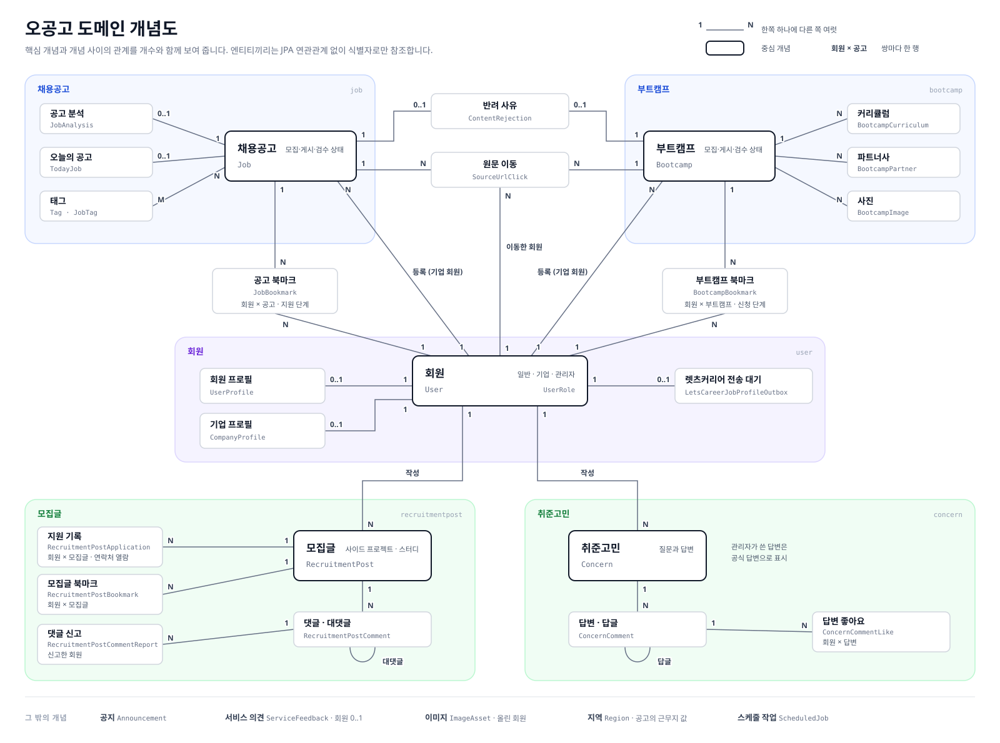

# 오공고 도메인 개념도

- 최종 변경일: 2026-10-09
- 예상 독자: 오공고를 처음 맡는 개발자
- 리뷰 상태: 팀 리뷰 필요

오공고의 도메인이 무엇이고 서로 어떻게 이어지는지 한 장으로 보여 주는 문서입니다. 서비스 전체 그림은 [서비스 개요](overview.md)에, 용어별 설명은 [용어 사전](glossary.md)에 있습니다.

개념도는 개념과 개념 사이의 관계, 그리고 관계의 개수(1 : N)를 보여 줍니다. 선 끝의 숫자는 그쪽 개념이 몇 개인지이고, `회원 × 공고`는 그 쌍마다 한 행만 있다는 뜻입니다. 조회 지표(`*Metric`)처럼 개념 이해에 필요 없는 엔티티와 필드는 담지 않으며, 정확한 값은 `ogonggo-core`의 각 `domain` 패키지를 기준으로 합니다. 원본은 같은 폴더의 [`domain-map.svg`](domain-map.svg)이고, 도메인이 바뀌면 이 SVG를 직접 고칩니다.

## 1. 영역별 설명

### 채용 콘텐츠: `job`, `bootcamp`, `contentreview`

오공고가 회원에게 보여 주는 정보 콘텐츠입니다. 회원은 읽고 저장할 뿐 수정하지 않으며, 실제 지원은 원문 링크로 나가서 합니다.

- **채용공고**(`Job`)와 **부트캠프**(`Bootcamp`)가 중심입니다. 둘 다 *모집 상태*(모집 중/마감)와 *게시 상태*(초안/게시/숨김)를 따로 가집니다. 모집 상태는 마감일에 따라 스케줄 작업이 바꾸고, 게시 상태는 사람이 바꿉니다.
- 채용공고에는 공고 분석, 오늘의 공고, 태그, 지표가 딸려 있고, 부트캠프에는 커리큘럼, 파트너사, 사진, 지표가 딸려 있습니다.
- 두 콘텐츠는 **등록 경로**와 **검수** 규칙을 공유합니다. 기업 회원이 올린 콘텐츠만 검수 대상이며, 승인하면 바로 게시되고 반려하면 숨겨지며 사유가 남습니다. 기업 회원이 내용을 고치면 다시 검수 대기로 돌아갑니다.

### 커뮤니티: `recruitmentpost`, `concern`

일반 회원이 직접 쓰는 글입니다.

- **모집글**(`RecruitmentPost`)은 사이드 프로젝트·스터디 팀원을 모으는 글입니다. 댓글·대댓글, 댓글 신고, 지원 기록, 북마크가 딸려 있습니다. 지원 기록은 실제 지원서가 아니라 연락처를 열어 본 기록입니다.
- **취준고민**(`Concern`)은 취업 준비 고민을 묻고 답하는 게시판입니다. 부모 댓글이 답변, 1단계 대댓글이 답글이며 관리자가 쓴 답변은 공식 답변으로 표시합니다.

### 사용자 활동: `bookmark`, `job`, `bootcamp`, `sourceurlclick`

회원이 채용 콘텐츠에 남기는 기록입니다.

- **북마크**(`JobBookmark`, `BootcampBookmark`)는 저장에 그치지 않고 지원 단계를 함께 관리합니다. 공고는 스크랩→지원 준비 중→지원 완료→면접→합격/불합격, 부트캠프는 스크랩→신청 전→신청 완료→활동 중→활동 완료로 회원이 직접 옮깁니다.
- **원문 이동**(`SourceUrlClick`)은 회원이 외부 링크로 나간 사실을 남깁니다. 취소할 수 없는 기록이며 회원·콘텐츠마다 한 행만 둡니다.

### 회원·계정: `user`

- **회원**(`User`) 한 테이블에 일반 회원, 기업 회원, 관리자가 함께 있고 역할(`UserRole`)로 구분합니다.
- 일반 회원은 렛츠커리어 계정과 1:1로 대응하고 **회원 프로필**(`UserProfile`)에 렛츠커리어 프로필의 사본과 오공고에서 입력한 정보를 둡니다.
- 기업 회원은 **기업 프로필**(`CompanyProfile`)을 가집니다.
- 학력·희망 조건이 바뀌면 **렛츠커리어 전송 대기**(`LetsCareerJobProfileOutbox`)에 한 행을 남기고, 스케줄 작업이 최신 값을 렛츠커리어로 보냅니다.

### 운영·기반: `announcement`, `servicefeedback`, `image`, `region`, `schedule`

여러 도메인이 함께 쓰거나 운영자가 관리하는 것입니다. 공지, 서비스 의견, 업로드 이미지, 지역 코드, 스케줄 작업 설정이 여기에 속합니다.

## 2. 주요 관계

| 출발 | 관계 | 도착 | 참조 방법 |
| --- | --- | --- | --- |
| 채용공고·부트캠프 | 등록한 기업 회원 | 회원 | `ownerUserId` (기업 등록만 있음) |
| 채용공고·부트캠프 | 고용24 원본 번호 | 고용24 | `externalId` (고용24 수집만 있음) |
| 공고 분석, 오늘의 공고, 공고 지표, 공고 태그 | 대상 공고 | 채용공고 | `jobId` |
| 반려 사유 | 반려한 콘텐츠 | 채용공고 또는 부트캠프 | `contentType` + `contentId` |
| 북마크 | 저장한 회원과 콘텐츠 | 회원, 채용공고·부트캠프·모집글 | `userId` + 콘텐츠 ID |
| 원문 이동 | 이동한 회원과 콘텐츠 | 회원, 채용공고 또는 부트캠프 | `userId` + `targetType` + `targetId` |
| 모집글, 취준고민 | 작성자 | 회원 | `authorUserId` |
| 댓글 | 대상 글, 작성자, 부모 댓글 | 모집글·취준고민, 회원, 댓글 | `postId`/`concernId`, `userId`, `parentId` |
| 회원 프로필, 기업 프로필, 전송 대기 | 소유 회원 | 회원 | `userId` |

엔티티끼리는 JPA 연관관계를 맺지 않고 상대의 식별자만 컬럼으로 가집니다. 이유와 예외는 [레이어와 모듈 아키텍처의 JPA 연관관계 규칙](../architecture/layers-and-modules.md#8-엔티티-삭제와-jpa-연관관계-규칙)을 봅니다.
